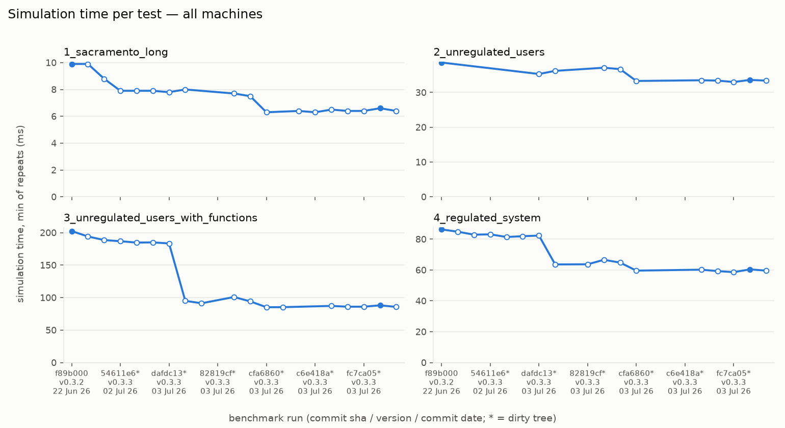

# Code

Kalix is open source under the MPL 2.0. The engine is Rust, the IDE is Java, and a Python package wraps the Rust core.

[<span class="kx-pill kx-pill--accent">github.com/chasegan/Kalix ↗</span>](https://github.com/chasegan/Kalix)

## Latest stats

<div class="kx-stats-split" markdown>

<div markdown>
<div class="kx-stat">
  <div class="kx-stat-num kx-ok">{{ health.models_passed | default(0) }}/{{ health.models_total | default(0) }}</div>
  <div class="kx-stat-label">Regression models verified</div>
</div>

Regression **models** checked in CI against pinned mass-balance baselines every release.
</div>

<figure markdown>
{ .glightbox }
<figcaption>Simulation time per test (ms) — one line per machine, per benchmark run.</figcaption>
</figure>

</div>

## Ways to get involved

<div class="kx-cards" markdown>
<div class="kx-card-item" markdown>
#### Report a bug or feature
Tracked openly on [GitHub Issues](https://github.com/chasegan/Kalix/issues).
</div>
<div class="kx-card-item" markdown>
#### Build from source
Clone the repo and build the engine, IDE, or Python package (below).
</div>
<div class="kx-card-item" markdown>
#### Collaborate on development
Run a remote team on a fork, or join the core team — see [Contact](../contact/).
</div>
</div>

## Build from source

```bash
git clone https://github.com/you/Kalix.git
cd Kalix
cargo build --release        # the Rust simulation engine + CLI
./gradlew :kalixide:run      # the Java IDE
```

<div class="kx-cards" markdown>
<div class="kx-card-item" markdown>
#### Rust
Install via [rustup](https://rustup.rs/); build with `cargo`.
</div>
<div class="kx-card-item" markdown>
#### JDK 23
Temurin or equivalent; the IDE builds with the bundled `gradlew`.
</div>
<div class="kx-card-item" markdown>
#### Python 3.12+
The package is built with `maturin` from `python/`.
</div>
</div>

## Design & brand

The site's visual system is documented alongside the design assets in the repository:

<div class="kx-cards" markdown>
<div class="kx-card-item" markdown>
#### Component & pattern sheet
Buttons, callouts, code blocks, tables, image framing — [view on GitHub ↗](https://github.com/chasegan/Kalix/tree/main/docs/web/style-guide/demo-pages).
</div>
<div class="kx-card-item" markdown>
#### Voice & tone
Plain, honest, state-don't-sell writing guidance.
</div>
<div class="kx-card-item" markdown>
#### Design tokens
`tokens.css` — the single styling source of truth.
</div>
</div>
