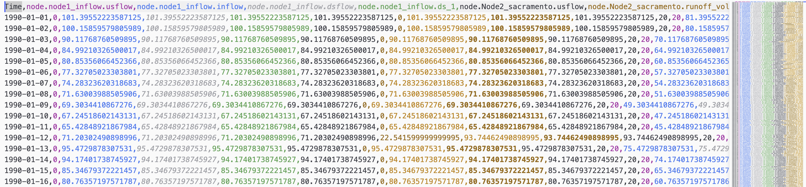

# Model outputs

Model outputs listed in the [outputs] section are recorded during the simulation, and available in the result window (KalixIDE) or written to file (Kalix CLI).

Refer to the node documentation ([Nodes](../nodes/index.md)) to see the available outputs.

## Output file format

The CSV format has a single header row, and a single timestamp column.

**Rows:** Column names are written in the top row, separated by commas.

**Columns:** Timestamps are written in the first column, and follow an ISO format. For daily timesteps this reduces to “YYYY-MM-DD”. This column is named “Time”. Subsequent columns contain model results. These appear in the output CSV file in the same order that they are specified in the model file.



You can read the output file into a Pandas dataframe for postprocessing simply:

```python
  import pandas as pd
  df = pd.read_csv('blarg.csv', parse_dates=['Time'], index_col='Time')
```
