# Ordering

# Overview

In regulated river systems, *river operators* use water infrastructure to control the flow of water. Irrigators, towns, and other water users submit orders specifying how much water they need. System operators then consider these requests to determine how to operate infrastructure — releasing water from storages, weirs, and managing pumps and channels — so that water arrives where it's needed, when it's needed. They must account for travel time through the system, potential tributary inflows, and transmission losses that may be incurred along the way.

Kalix’s ordering system simulates this process, providing a way for models to represent the operation of infrastructure to meet user demands. The ordering system enables demand nodes (e.g. users and flow requirement nodes) to communicate their requirements to upstream infrastructure nodes (e.g. storages and offtakes) which then respond by making releases and modulating operations accordingly.

## The Ordering System

Kalix’s ordering system follows a heuristic rules-based approach to ordering and operation (c.f. network-optimised approaches available in some platforms). Imperfect anticipation of future inflows, losses, and streamflow routing behaviour can lead to surpluses or shortfalls in water delivery, as occurs in real river systems.

Kalix’s simple ordering system works as follows. Steps 1-2 are done once during the initialisation of the model. Steps 3-5 constitute the ***ordering phase*** and are done every timestep. Steps 4-5 constitute the ***flow phase*** and are done every timestep.

1. identifying ***regulated zones***,

2. estimating ***travel times*** to the nodes within those zones,

3. collecting ***orders*** reflecting user demands and other flow requirements,

4. adjusting orders according to ***expected losses and inflows***,

5. ***directing orders*** to appropriate infrastructure nodes,

6. ***simulate operation*** of infrastructure nodes to deliver orders,

7. ***simulate water flow*** through the model network.

This system is similar, but not identical, to the ordering system in other modelling platforms such as IQQM and Source. Some key aspects of the system are:

- User nodes in regulated zones do not send orders by default. They must opt-in to the ordering system by using the `regulated = true` property.

- The travel time for each node in a regulated zone is an estimate of the streamflow routing lag between the supply (typically a single storage, but caveats are explained below) and the node. The travel time is assumed to be constant throughout the simulation, and is based on the streamflow lag at a typical flow rate `typical_regulated_flow = 100`.

- Orders can be manipulated using the minimum and maximum order nodes. Orders do not propagate outside the regulated zones.

The simple ordering system is explained in detail below.

### Regulated Zones

Areas downstream of storage outlets are designated regulated zones. This storage node is the supply for the zone immediately below it. The zone extends downstream to (a) the next storage that can act as a supply, (b) the end of the system.

When two regulated zones join at a confluence (confluence node or other node) the reach downstream can be considered part of both zones. Nodes below the confluence may be supplied by the storage of either zone. The section on ***directing orders*** describes how this works in more detail.

### Travel Times

The travel time for each node in a regulated zone is an estimate of the streamflow routing lag between the supply storage and the node. The travel time is assumed to be constant throughout the whole simulation, and is based on the streamflow lag at a typical flow rate (specified by the modeller at the routing nodes, e.g. `typical_regulated_flow = 100`).

For nodes in regulated zones below confluences, the travel time is based on the longest branch.

### Adjusting Orders According to Expected Inflows and Losses

[How Orders Propagate](ordering.md)

User nodes in regulated zones with `regulated = true` place orders based on the demand value. If the travel time for the node is T=0, the node will try to extract their demand in the same timestep, when the flows are calculated. But if the travel time for the node is T>0, then the user will not try to extract that volume for another T timesteps.

User nodes not located in regulated zones do not place orders. User nodes with `regulated = false` (default) do not place orders.

Streamflow losses impede the delivery of regulated flows. To account for losses, orders are automatically increased as needed, based on the flow-loss relationship at the relevant loss nodes.

Inflows represent opportunities for demands to be satisfied without releasing all orders from the supplying storage(s). Inflows in regulated zones are evaluated during the ordering phase. If the travel time at the inflow node is T=0, the full inflow is assumed to be available this timestep and the orders are reduced accordingly. If T>0, the relevant inflow is the one that occurs after T timesteps. This value is not known yet, therefore the model uses a simple calculation to estimate how much inflow might be available `assumed_inflow = current_inflow * recession_factor`.

Inflows on unregulated tributaries are not accounted for by the ordering system. While they may contribute flows to the system, they will not reduce the orders.

### Directing Orders

Orders propagate in an upstream direction, from users to the supply storage(s).

At loss nodes and inflow nodes the orders are adjusted as discussed above.

When a node, which is *not a confluence*, has multiple incoming links (branches), the full order is sent up each regulated link. This allows the modeller to make flow-phase decisions about how (from which branch) the order will be met. Note that a naive configuration could result in the order being met by both branches. If the modeller want more control over how the orders are apportioned up each branch, they should use a confluence node.

At confluence nodes, the orders are directed up regulated branches on the basis of the harmony rule expression. If the upstream branches have different travel times (T1 > T2), orders designated for the shorter branch are delayed (by an amount DT = T1-T2) such that the ordered water will arrive at the user node at the right time.

### Simulating Operation

Regulated outlets on storage nodes are operated to satisfy orders.

Splitters (TBD).


## How Orders Propagate

Nodes send **orders** upstream to request flows from operational infrastructure. Orders propagate from downstream to upstream, and this is done every timestep in the **ordering phase**, which occurs entirely before the flow phase (when flows are calculated).

# A starting point

The model below has a **regulated\_user** node “0002\_user” which orders water according to a timeseries. There is a **storage** node “0001\_dam” which is upstream of the user and which tries to satisfy the order.

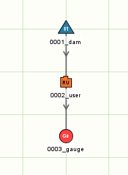

```toml
[node.0001_dam]
type = storage
loc = 0, 0
initial_volume = 2000
dimensions = 0, 0, 0, 0, 1, 10000, 0, 0, 1.1, 10001, 0, 10000, 1.2, 10002, 0, 10000
ds_1 = 0002_user

[node.0002_user]
type = regulated_user
loc = 0, 40
order = data.patterns_csv.by_name.pattern_1
ds_1 = 0003_gauge

[node.0003_gauge]
type = gauge
loc = 0, 80
```

The plot below shows the order (solid green), the storage downstream flow (dotted blue), and the storage volume changing over time (solid red). Can you use the plot to see the following?

- This example has an order timeseries that starts at 0, and increases in steps to a maximum value of 300 ML/day, and then decreases again to 0.

- The resulting flow matches the order (0001\_dam.ds\_1 = 0002\_user.order).

- The storage volume reduces from an initial value of 2000 ML to a final volume of 200 ML.

- The flow at the bottom is zero (yellow line) because the flow released from the dam is diverted at the user node.

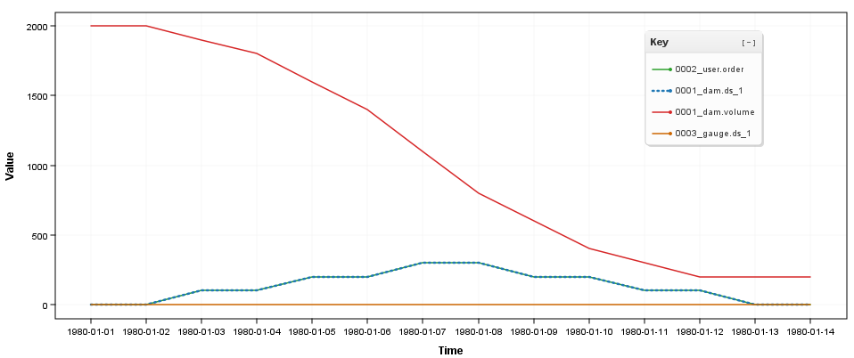

# How do orders propagate through losses?

The following model introduces a **loss** node between the user and storage. This loss node has a known flow-loss relationship (the table), and this causes flows >200 ML/d to be partly lost. When orders propagate through loss nodes, they are automatically adjusted to cover the losses.

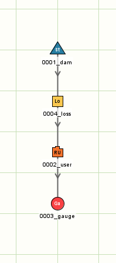

```toml
[node.0001_dam]
type = storage
loc = 0, 0
initial_volume = 2000
dimensions = 0, 0, 0, 0, 1, 10000, 0, 0, 1.1, 10001, 0, 10000, 1.2, 10002, 0, 10000
ds_1 = 0004_loss

[node.0004_loss]
type = loss
loc = 0, 40
table = Flow [ML], Loss [ML], 
        0        , 0, 
        200      , 0, 
        400      , 150, 
        1000     , 150, 
ds_1 = 0002_user

[node.0002_user]
type = regulated_user
loc = 0, 80
order = data.patterns_csv.by_name.pattern_1
ds_1 = 0003_gauge

[node.0003_gauge]
type = gauge
loc = 0, 120
```

The presence of the loss node changes the results:

- Orders for 0, 100, 200 ML/d are not adjusted because the loss is 0 in this range.

- Orders for 300 ML/d are increased to 450 ML/d as they propagate through the loss node because an upstream flow of 450 ML/d would be required in order to deliver 300 ML/d below the loss node (450 - 150 = 300 ML/d). The storage release (dashed blue line) is now higher than the original order (green line), and this extra flow is exactly enough to cover the losses (the purple line).

- In this example the order adjustment can be perfectly calculated, and the flow at the bottom of the system is still zero (yellow line).

- The storage volume drops more quickly now, and actually becomes empty on Jan 11 meaning there is no water to release on Jan 12.

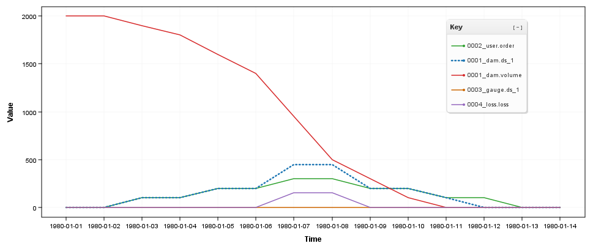

|  |  |
| --- | --- |
| **Note about 100% losses** |  |
| It is possible to construct loss relationships that lose 100% of additional flows above a certain point. The example on the right has no losses below 200ML/d, but then loses 100% of flow >200ML/d. The ordering system recognises this limitation and caps upstream orders at 200ML/d. | `table = Flow [ML], Loss [ML],   0 , 0,   200 , 0,   400 , 200,  1000 , 800` |

# How do routing nodes affect orders?

Streamflow routing can cause flows, including flows intended to satisfy orders, to be delayed. **Regulated\_user** nodes who are separated from their supplying by routing will postpone their demands (that this their intention to divert water) to align with the estimated lag based on the properties of the streamflow routing.

The model below has a **routing** node position between the user and storage. The routing node has approximately 3 days of lag (= 2 days of pwl storage routing + 1 day of pure lag).

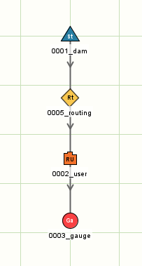

```toml
[node.0001_dam]
type = storage
loc = 0, 0
initial_volume = 2000
dimensions = 0, 0, 0, 0, 1, 10000, 0, 0, 1.1, 10001, 0, 10000, 1.2, 10002, 0, 10000
ds_1 = 0005_routing

[node.0005_routing]
type = routing
loc = 0, 40
lag = 1
pwl = 0        , 2, 
      100      , 2, 
      200      , 2, 
      1000     , 2,
typical_regulated_flow = 200
ds_1 = 0002_user

[node.0002_user]
type = regulated_user
loc = 0, 80
order = data.patterns_csv.by_name.pattern_1
ds_1 = 0003_gauge

[node.0003_gauge]
type = gauge
loc = 0, 120
```

The regulated\_user node places the same orders (the same timeseries pattern). The presence of the routing node changes the results in two ways:

- The user postpones their demand (blue) by 3 days compared to the order timeseries (green). The intention is for this to allow enough time for dam releases to reach the user before the user tries to divert their demands.

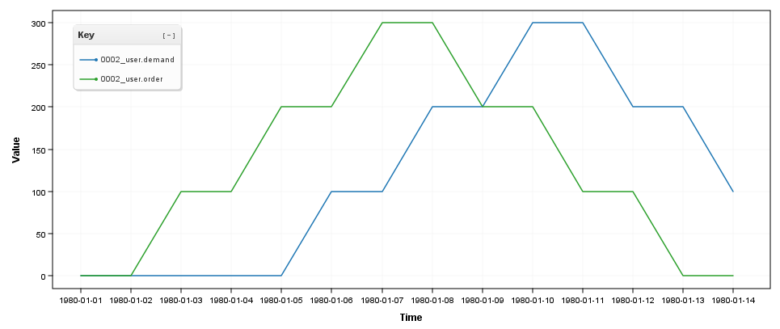

- Despite attempting to account for the lag, the flows that reach the user node (red) do not match the postponed demand pattern (solid blue) exactly. Some of the flow arrives early and the peak of the demand is not met. In the end there is a shortfall between the intended diversion (solid blue) and the actual diversion (dashed blue). This happens because the storage routing in this example is nontrivial and the simplistic demand-lagging method does an imperfect job of anticipating the routed flows. This is not a bug - in some ways it reflects the practical difficulty of delivering water in a river system that contains nontrivial streamflow processes.

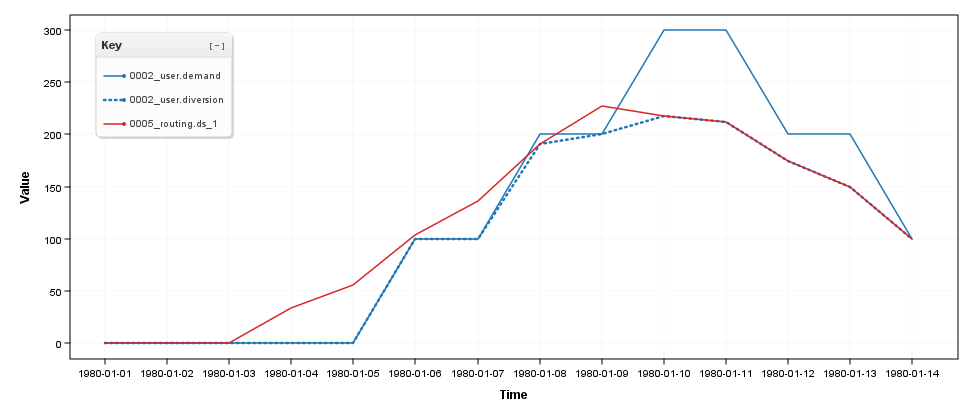

One way to overcome shortfalls due to nontrivial streamflow processes is to apply an overorder factor to the order. By scaling up all the orders, it is more likely that there will be enough water to meet the actual demand on any given day. Using an overorder factor comes at the cost of running the system less efficiently.

# How do orders propagate through inflow nodes?

Inflow nodes on regulated pathways

(Below is CKG ‘draft’/WIP)

Inflows may satisfy some or all of the order required for a r**egulated\_user.** When orders propagate through inflow nodes with the parameter `expected_inflow` set, they are automatically adjusted (i.e. partially or wholly satisfied) by the expected inflow.

## Case 1: Constant expected inflow

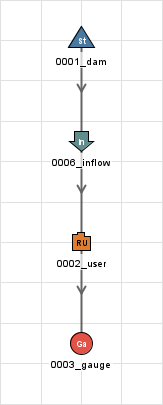

```toml
[node.0001_dam]
type = storage
loc = 0, 0
initial_volume = 2000
dimensions = 0, 0, 0, 0, 1, 10000, 0, 0, 1.1, 10001, 0, 10000, 1.2, 10002, 0, 10000
ds_1 = 0006_inflow

[node.0006_inflow]
type = inflow 
loc = 0, 40
inflow = 100
expected_inflow = 100
ds_1 = 0002_user

[node.0002_user]
type = regulated_user
loc = 0, 80
order = data.patterns_csv.by_name.pattern_1
ds_1 = 0003_gauge

[node.0003_gauge]
type = gauge
loc = 0, 120
```

The regulated\_user node places the same orders (the same timeseries pattern). The inflow node (blue) causes the orders from the user (green) propagated up to and satisfied by the dam (red) to reduce by 100 ML/d compared to the case without the inflow node.

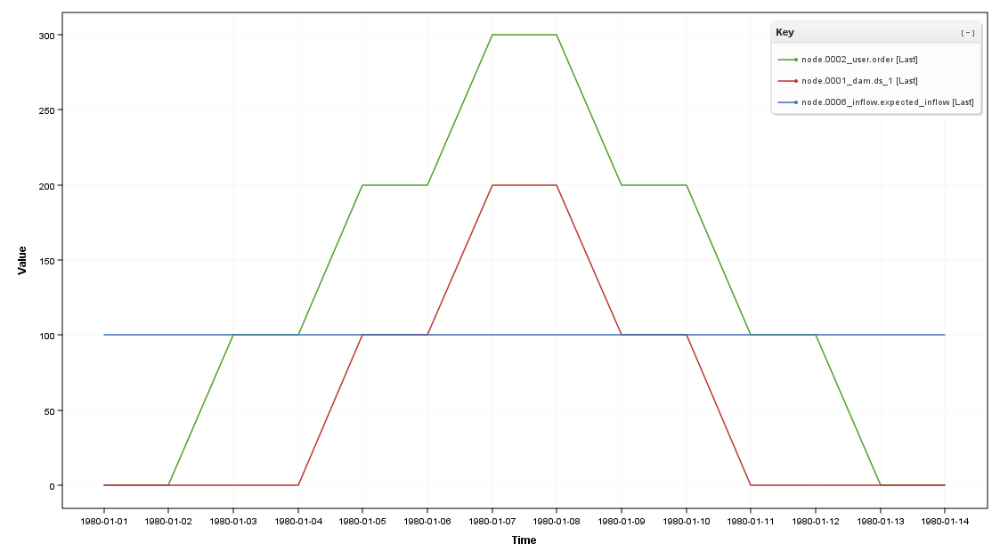

## Case 2: Recession factor

We now consider a case where the expected inflow is defined as a proportion of the (previous day’s) inflow. Consider the following alternative definition of node 0006\_inflow, using the same timeseries pattern as the user node for demand.

```toml
[node.0006_inflow]
type = inflow 
loc = 0, 40
inflow = data.patterns_csv.by_name.pattern_1
expected_inflow = 0.5*this.inflow[-1,0]
ds_1 = 0002_user
```

Here the expected inflow is set to a proportion of yesterday’s inflow, producing the following relationship:

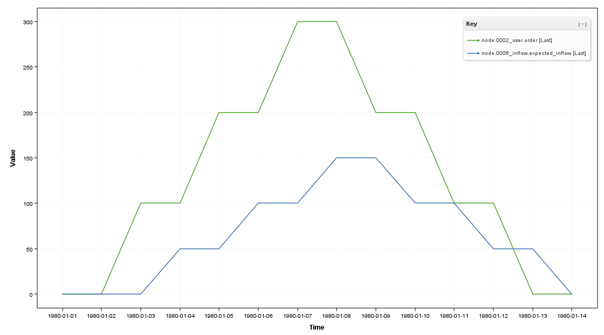

Since the inflow and demand patterns are identical here, there is no demand shortfall on 1980-01-13 despite expected inflow being larger than the actual inflow.

The volume required to be released from the dam then takes on the following saw-tooth shape (in red):

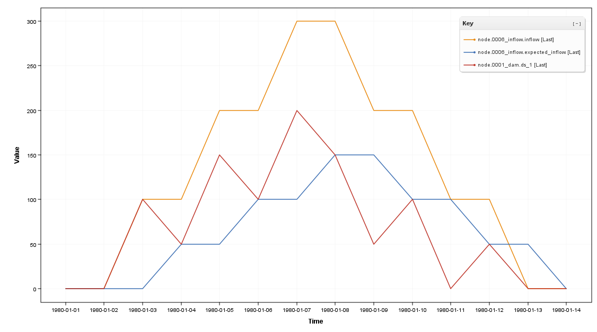

# TODO

- Confluences
  - Expected inflow (sum of all unregulated paths?)
  - Regulated streams (2 at most)
  - Harmony fraction
  - Lag
  - Why use confluences over other nodes e.g. gauge

- Order constraint nodes
  - Min/max/set order

- Passive storages

- Real valued order lag (PWL etc) - caution re: what nodes will “collapse the wavefunction” as it were
