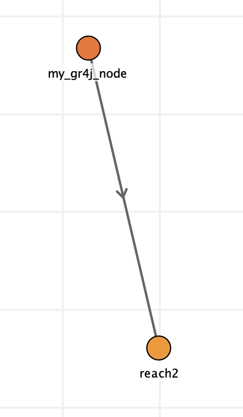

# Getting Started

# About Kalix

Kalix is a hydrologic modelling platform for catchment and river simulation. It is focussed on core performance and technical usability. It aims to empower modellers through:

- An open-source licence that ensures it will be available and free forever

- Blazing fast simulation performance

- Platform independence (Linux, Mac, Windows)

- Text-based model file format

- Proven hydrology

- Calibration tools building on the best

- Water management and operations

- Commandline application (Kalix CLI) and Desktop graphical application (Kalix IDE)

- Run management

- Python bindings for integration into data science workflows

- AI-friendly interfaces that invite a new era of AI-supported model development.

Kalix models conceptualise river systems as a network of node and links.

- **Nodes** are active elements that represent lumped river processes, modifying the flow of water through the network.

- **Links** are passive elements, defining the logical connection between nodes and passing water from one node to the next.

The model operates on a constant timestep (typically a daily timestep, but this is configurable).

# Where to get it

|  |  |
| --- | --- |
| **For modellers** |  |
| Executables: | Refer to [Downloads](../downloads.md) |
| Online documentation: | https://chasegan.notion.site/Kalix-User-Guide-762687200b564e8e8c82b4f98879974f |
| Software licence details: | <https://www.mozilla.org/en-US/MPL/2.0/> |
| **For developers** |  |
| Getting started | <https://github.com/chasegan/Kalix/wiki/Getting-started> |
| Source code on github: | <https://github.com/chasegan/Kalix> |
| Task management on github: | <https://github.com/users/chasegan/projects/1/views/2> |
| Dev notes on github: | <https://github.com/chasegan/Kalix/wiki> |

# Quick Example

```rust
[kalix]
version = 0.0.1

[inputs]
./data/rex_mpot.csv
./data/rex_rain.csv

[node.my_gr4j_node]
type = gr4j
loc = -186.86, 316.11
area = 22.8
rain = data.rex_rain_csv.by_name.value
evap = data.rex_mpot_csv.by_name.value
params = 1999.996, 5.9991, 65.224, 0.380800
ds_1 = reach2

[node.reach2]
type = routing_node
loc = -150.24, 469.70
lag = 2

[outputs]
node.my_gr4j_node.dsflow
node.reach2.storage
node.reach2.dsflow
```


