# Kalix IDE

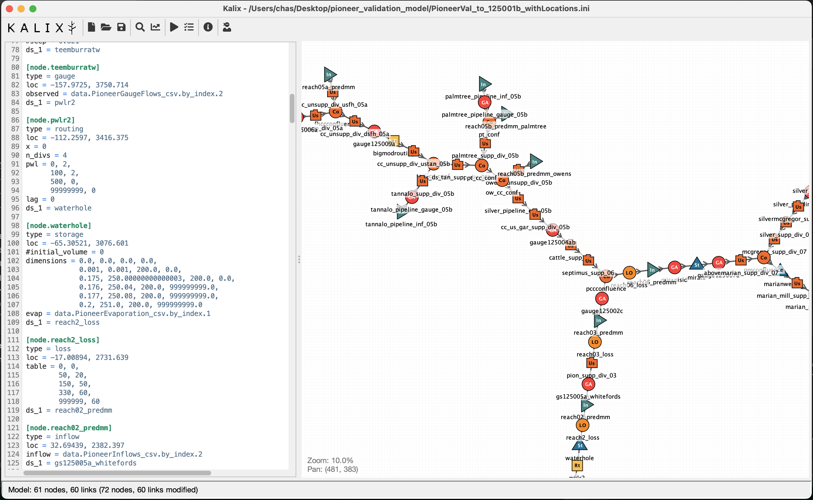

## Interactions

**Rename node** from the schematic map context menu

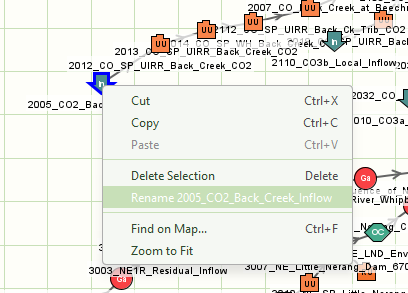

Model editor context menu item **Show on Map** will select and centre the node you’re working on in the schematic map

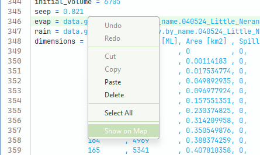

Click and drag to select nodes on the schematic map. Then drag to move or ctrl+drag to rotate.

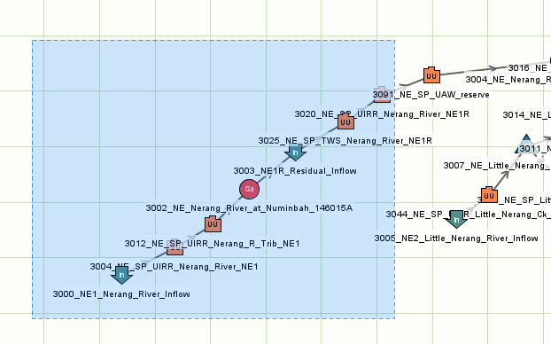

**Draw a link** by hovering just outside a node until a ring appears, then dragging to the downstream node. The cursor shows when a drop isn't allowed (the same node, an existing link, or a loop). Esc cancels; Ctrl+Z undoes.

The link is written as `ds_N = <downstream>` at the first free outlet. If every outlet the node type allows is taken, the last one is re-pointed instead (`ds_1` for most nodes, `ds_2` for a splitter, `ds_4` for storage). To use a different outlet, edit the `ds_N` numbers in the text.

Ctrl+f in the model editor for **find**, or Ctrl+h for **find-and-replace**

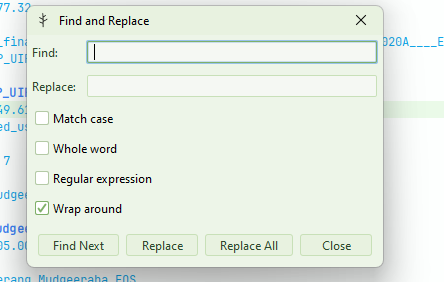

**Navigate Back** and **Navigate Forward** allow you to move between locations you have visited in the model text. Keyboard shortcuts make this faster.

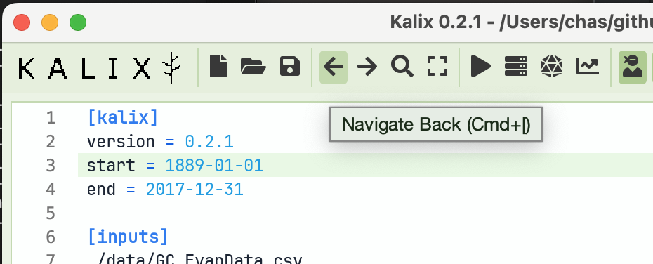

**Table View** for node parameters that accept tabular values. Find this in the editor’s context menu, or by using the shortcut Ctrl+t.

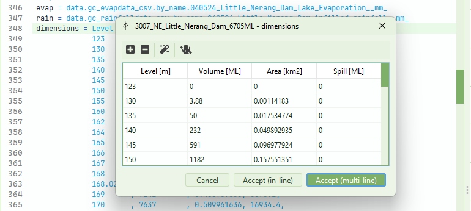

**Copy Location** by right-clicking your desired location on the map and using the context menu item.

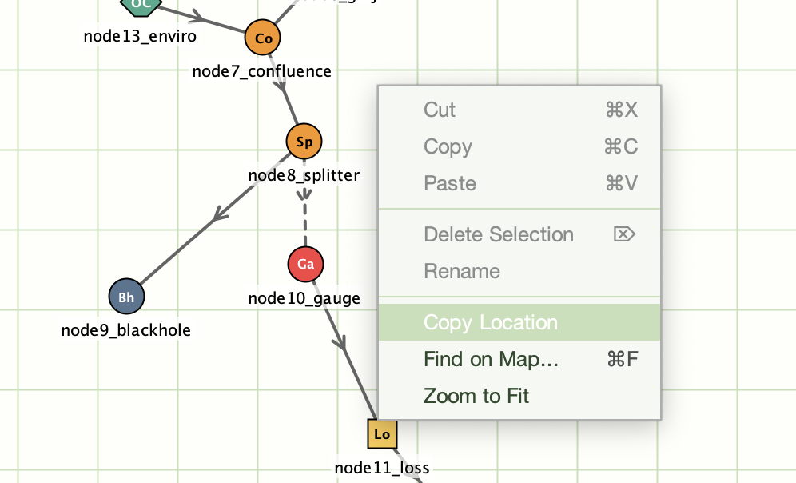

Use the **Navigate Back** and **Navigate Forward** buttons to flick back and forth between locations you have visited in the model file.

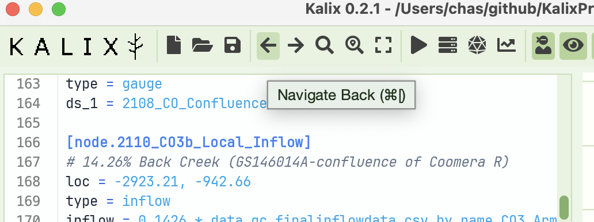

**Undo/redo in plots**! Buttons in the Run Manager’s plotting toolbar allow you to undo and redo your plotting actions (data selection, zoom, plot type).

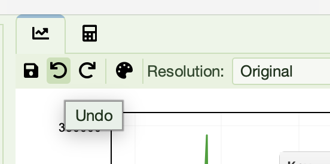

**Shift + click + drag to zoom** into a specific part of the plot using the mouse. This rectangular lasso zoom is handy for focusing in specific events in the hydrograph.

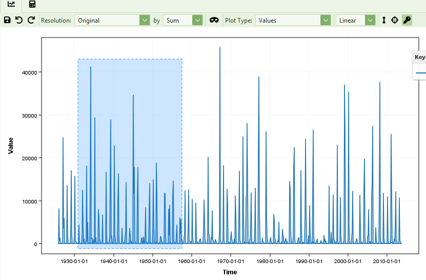

The **Parameter Sheet** shows node properties in a table. Filter by node type and name. Great for model review or bulk edits. Find it in the Tools menu.

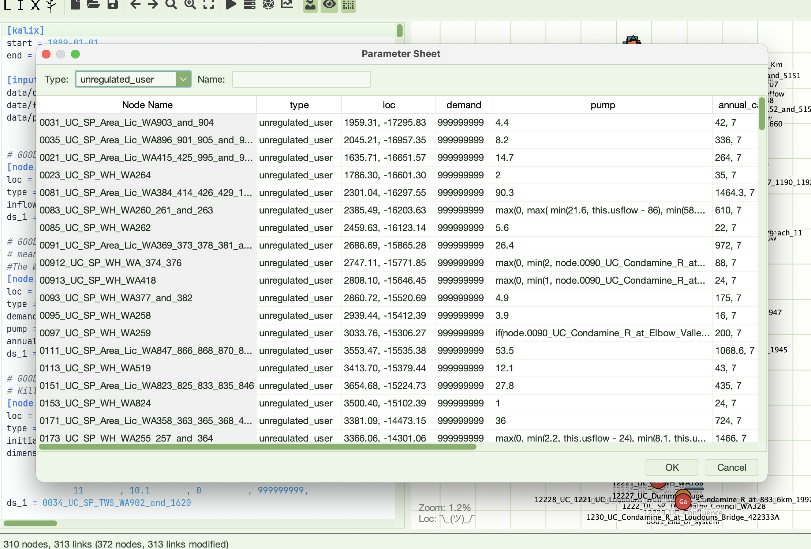

**Auto-complete** is accessible from the context menu, or the ctrl+space keyboard shortcut. Suggestions include data references and model result references. The list filters as you type and is context aware.

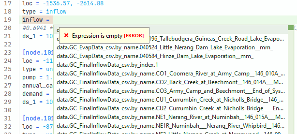

**Cut/copy/paste** nodes in the schematic map using the context menu or keyboard shortcuts. Paste will paste nodes onto the schematic at the coordinates where you opened the context menu. These will appear in the text-based model representation immediately below the section where the cursor currently is. (If you want to paste below a specific node, click on that node to place the cursor there before pasting).

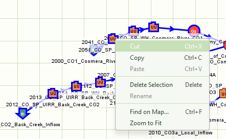

Ctrl+f to **Find node** on map. This is also available from a button in the toolbar.

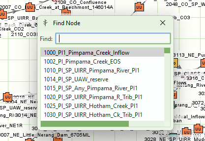

**Linting** warnings and errors highlight issues with the model file before runtime

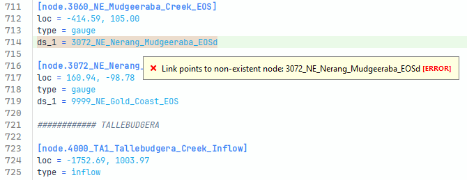

**Undo and redo**, right out of the box ;)

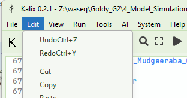

Right-click on a downstream link and use **Go to Node Definition** to navigate there with one click.

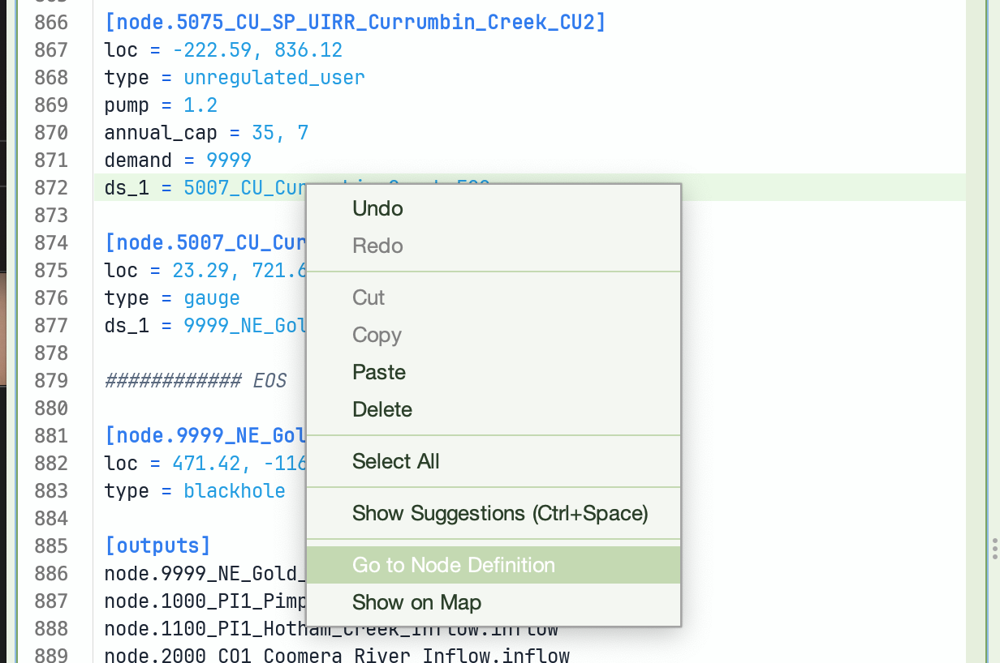

If you’re inside a terminal and want to edit a model, you can **launch the IDE from the terminal** and pass in the name of the model file.

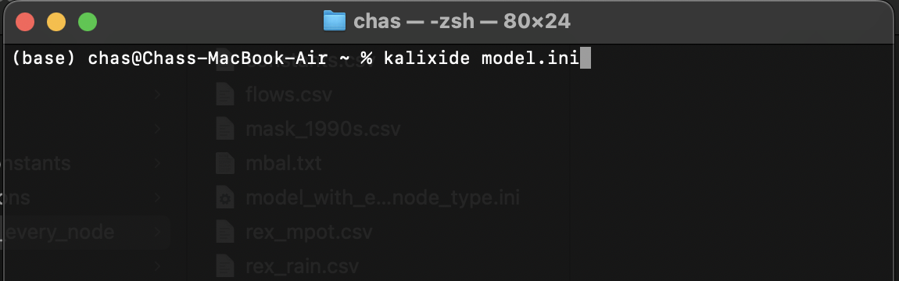

Look for the **Plot Palettes** button in the plotting tool create custom colour palettes. And click the line sample in the key to change the colour and style of a given line.

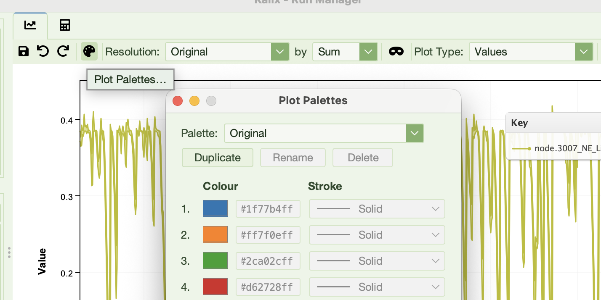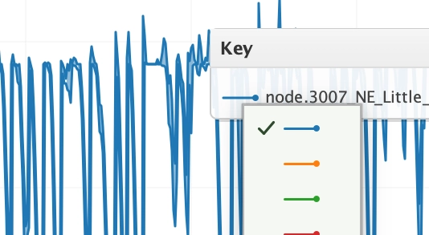

## Themes

Themes can be independently set for the Editor Syntax, Node Palate and the Application Window.

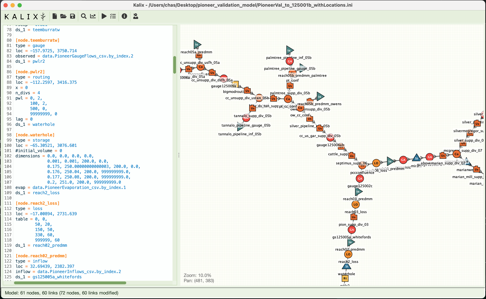

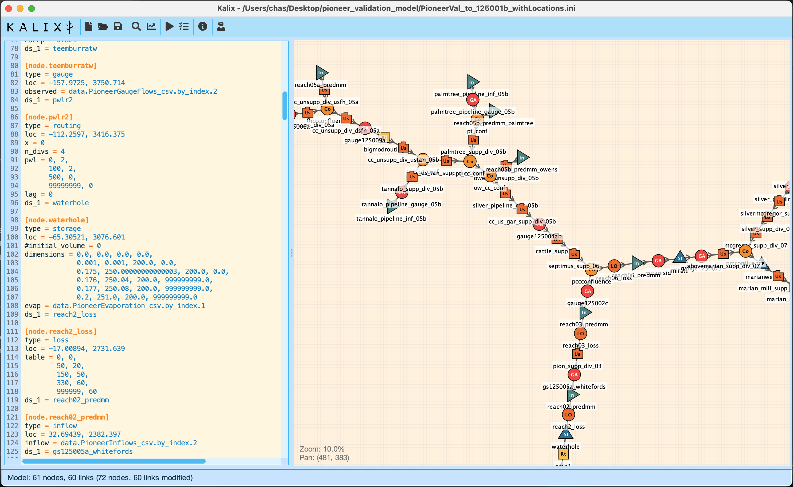

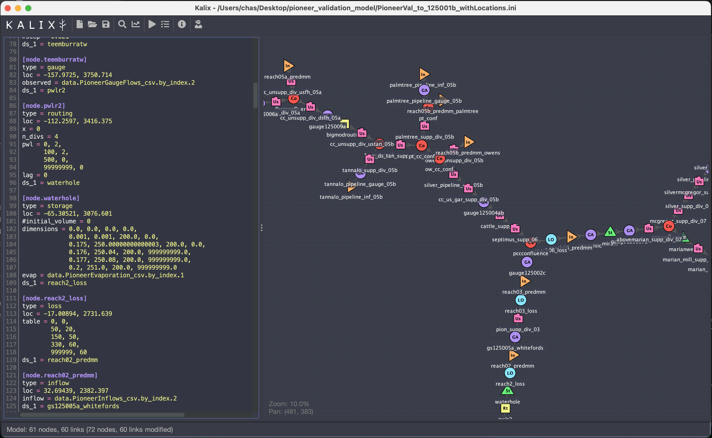

## Run Manager

It is a run manager. Yes.

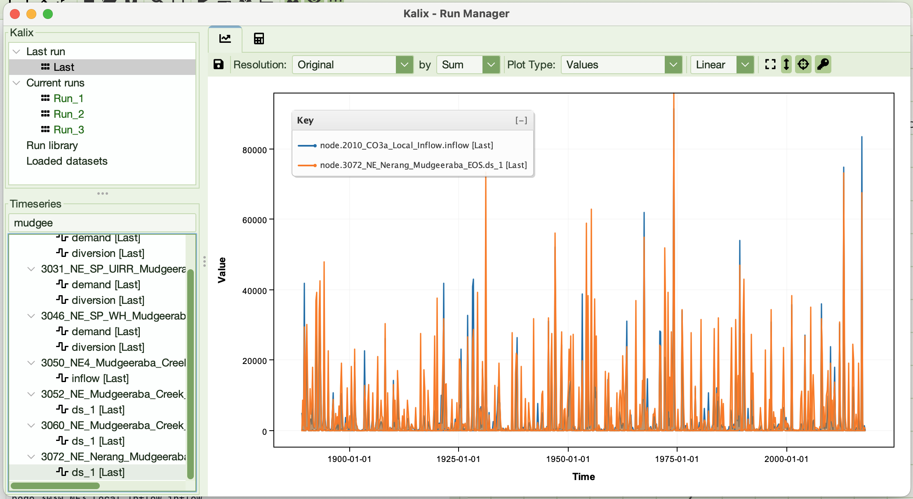

### Filtering the Timeseries tree

Type in the box above the **Timeseries** tree to show only the series you want. Each series is matched on its full name (such as `node.inflow_3.ds_1`) and on its source (such as `Run_2` or `flows.csv`). Case is ignored.

| You type | Shows |
|----------|-------|
| `inflow` | Every series whose name or source contains `inflow`. |
| `inflow_*.ds_1` | `ds_1` of every node named `inflow_…`. `*` matches anything, dots included; `?` matches one character other than a dot. |
| `inflow *.ds_1` | `ds_1`, and not `ds_10`, of every inflow node. Spaces separate terms, and a series shows only if it matches all of them. |
| `inflow !dummy` | Every inflow series except those with `dummy` in the name. `!` excludes whatever a term matches. `!dummy` on its own shows everything else. |
| `"qu art"` | A name with a space in it: quotes keep it one term. Wildcards still work inside quotes. |
| `/inflow_[34]\.ds_1$/` | A regular expression (regex), written between slashes. It may contain spaces; write `\/` for a slash. |
| `Run_2` | Series whose name or source contains `Run_2`, so the run `Run_20` too. `/^Run_2$/` picks Run_2 alone, and `Run_2 inflow` narrows to its inflow series. |

A term with `*` or `?` must match whole parts of the name, between dots: `inflow_*.ds_1` matches `node.inflow_3.ds_1` but not `node.inflow_3.ds_10`. A term without them matches anywhere: `ds_1` matches both.

If the filter doesn't make sense (a quote or regex left open, a `!` with a space after it, or an unclosed bracket in a regex), the box turns red and its tooltip says why. The tree keeps the last filter that worked until you fix it. A filter that is fine but matches nothing shows "No series match the filter".

The filter only changes what the tree shows. Ticking a folder while filtering ticks just the series you can see, which makes it quick to plot every match. Series you ticked before filtering stay plotted even when the filter hides them.

### Derived series

A **derived series** is the point-by-point sum of series from one source: a run, the **Last run**, or a loaded dataset. Use one to total the flows through several nodes, or the demands of a group of users.

**Making one.** In the **Timeseries** tree, either select the series to sum and right-click **Sum selected…**, or tick them and right-click **Sum checked…**. Then give it a name: letters, digits and underscores (a suggestion such as `sum_1` is filled in). Both items are greyed until there are at least two series to sum. Ticking suits "all but a few": tick everything, then untick the ones to leave out.

- Selecting (or ticking) a folder such as `node.mygr4j` sums every series under it, as the tree shows it. Use the filter to narrow what is summed, for example to every `ds_1`; only series the tree currently shows are summed.
- When the selected series come from several sources (for example `Run_1` and `Run_2`), Kalix makes one derived series per source, each summing that source's series, so totals can be compared across runs. Every source must include every selected series, so series from a run and from a loaded dataset can't be summed together.
- A derived series can be an input to another derived series of the same source.
- The series must have identical timestamps. A point missing in any input is missing in the sum.

Derived series appear under **Derived series** in the Run Manager's source tree, grouped by source, and as `derived.<name>` in the **Timeseries** tree, where they plot like any other series. The new series is ticked and plotted for you; if the filter would have hidden it, the filter is cleared. Hover over a derived series in the source tree to see what it sums.

`derived.` is a Run Manager label, not a model namespace: a model expression can't refer to `derived.sum_1`. To have the model itself record a total, define it in a [`[var.*]` block](vars.md).

**Derived series of Last run** are recomputed whenever a new run completes, inputs before anything made from them. If the new run can't supply an input (a series is missing, say), the derived series is cleared and its row in the statistics view says why; it comes back when a later run can. If the run that is Last is removed, Last moves to the newest remaining run and its derived series follow.

**A derived series lasts as long as its source.** Removing a run or a dataset removes its derived series too, as it does the run's other series. To keep a total past its source, save it first. Derived series also last only for the session.

**Managing derived series.** Right-click a derived series in the source tree to **Copy inputs** (its inputs to the clipboard, one per line), or to **Save…**, **Rename…** or **Delete** it. Right-click a group to save or delete all of its derived series, or **Derived series** itself to delete every derived series. Derived series save as CSV, zipped CSV or Pixie, one column per derived series.

## Error log

A message in the status bar is replaced by the next one, and an error dialog is gone once you close it. The IDE keeps every error it has shown you this session in an **error log**. Once there is one, an info icon appears at the left of the status bar, with the number of errors beside it; click it to open the log in a tab. Each error is one line with the time it was shown, and the tab fills in as more arrive. Select and copy from it like any other text.

The log is read-only and lasts only for the session: it is not saved anywhere, so copy out what you want to keep.

## Docking

Fn+F9 reveals docking capabilities in the main window. Holding Fn+F9, look for the blue handles that appear in the top left of the schematic editor and text editors. This feature is in alpha. Good luck 😄.

## KalixIDE Preferences

Preferences are automatically saved in the preference file, which lives in the `./app/kalix_prefs.json` file relative to your KalixIDE executable. Some of these are configurable at File > Preferences, while others are simply settings remembered from your last session.
