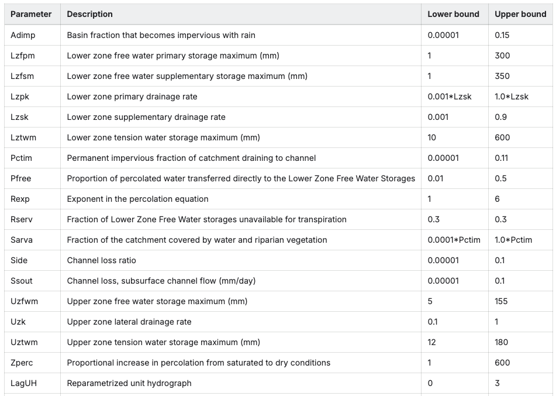

# Sacramento

## At a glance…

This node uses a Sacramento rainfall-runoff model to represent catchment inflows from a catchment of a fixed area. The model takes rainfall and potential evapotranspiration data and determines inflows. The Sacramento model has 17 parameters (including laguh) representing catchment characteristics.

```ini
[node.my_sacr_node]
type = sacramento
loc = 20, 30
area = 165
rain = data.rex_rain_csv.by_name.value
evap = data.rex_mpot_csv.by_name.value
params = 0,45,60,0.01,0.01,150,0,0.11,1.5,0,0.2,0.01,25,0.2,47,15,0.1 
ds_1 = my_other_node
```

## Node properties

| Property | Description |
| --- | --- |
| [node.?] (compulsory) | Start of node declaration. This says we are creating a node, and also defines the name of the node. Node naming conventions are discussed at . Example: `[node.my_sacr_node]` |
| type (compulsory) | The node type, which is “sacramento” in this case. `type = sacramento` |
| loc (compulsory) | The location of the node in cartesian coordinates.  Example: `loc = 20, 30` |
| area (compulsory) | The catchment area [km2].  Example `area = 165` |
| rain (compulsory) | Rainfall data [mm]. Example: `rain = data.rex_rain_csv.by_name.value` |
| evap (compulsory) | Potential evapotranspiration data [mm]. Example: `rain = data.rex_mpot_csv.by_name.value` |
| params (compulsory) | The Sacramento model parameters:   adimp, lzfpm, lzfsm, lzpk,  lzsk, lztwm, pctim, pfree,  rexp, sarva, side, ssout,   uzfwm, uzk, uztwm, zperc,   laguh Example: `params = 0, 45, 60, 0.01, 0.01, 150, 0, 0.11, 1.5, 0, 0.2, 0.01, 25, 0.2, 47, 15, 0.1` |
| ds\_1 (optional) | Name of the downstream node. This property defines a downstream link. Gr4j nodes may only have 1 downstream link.  Example: `ds_1 = my_other_node` |

All seventeen model parameters — and the rainfall-weighting terms, when `rain` is a linear combination of stations — can be calibrated with the built-in optimiser: see [Optimisable parameters](optimisable-parameters.md).

## Results associated with this node

| Result | Description |
| --- | --- |
| dsflow | Downstream flow [ML] |
| usflow | Upstream flow [ML] |
| ds\_1 | Downstream flow on link ds\_1 [ML] |
| ds\_1\_order | Order on link ds\_1 [ML] |
| runoff\_volume | Catchment runoff volume from Sacramento model [ML] |
| runoff\_depth | Catchment runoff depth from Sacramento model [mm] |
| rain | Input rainfall [mm] |
| evap | Input evapotranspiration [mm] |
| flosf | Internal flux component - surfaceflow [ML] |
| floin | Internal flux component - interflow [ML] |
| flobf | Internal flux component - baseflow [ML] |
| roimp | Internal flux component - impervious runoff [ML] |
| area | Catchment area [km2] — the declared `area` value, static for the whole run. See [Static Node Properties](referencing-model-results.md#static-node-properties). |

## How the node works

The sacramento node adds inflows from a Sacramento rainfall-runoff model (Burnash, 1973) to the system. The downstream flow is therefore

`dsflow=usflow+runoff\_volume`

Parameters for soil moisture and Stores

- UZTWM (Upper Zone Tension Water Maximum): Defines the maximum capacity of the upper soil zone to hold water under tension.

- UZFWM (Upper Zone Free Water Maximum): Represents the maximum capacity of the upper zone to hold free water.

- LZTWM (Lower Zone Tension Water Maximum): The maximum capacity for tension water in the lower soil zone.

- LZFSM (Lower Zone Free Water Maximum for Soil): Maximum capacity for free water in the lower zone soil.

- LZFPM (Lower Zone Free Water Maximum for Percolation): Maximum capacity of the lower zone's free water that influences percolation.

- RSERV (RSERV parameter): Not always optimised due to its low sensitivity, this parameter is generally the amount of water in the lower zone's free water stores that isn't available for transpiration.

Parameters for Flow Rates and Percolation

- LZPK, LZSK, UZK: These depletion coefficients determine the rate at which water discharges from the free water storages in the upper and lower zones.

- PFREE: Controls the percolation rate of water from the upper zone to the lower zone.

- REXP (Percolation exponential factor): Modifies the rate of water percolation from the upper to the lower zone.

- ZPERC: Another parameter influencing the percolation of water from the upper to the lower free water stores.

Parameters for Runoff and Losses

- PCTIM (Percent Impervious): The proportion of the catchment that is considered an impervious area, which generates quick runoff.

- ADIMP (Impervious Area Delay): Influences the time delay for runoff from the impervious area.

- SIDE: A parameter related to channel side losses.

- SSOUT: Represents losses from the surface storage.

- SARVA: A parameter for losses from the system.

Parameters for Runoff Routing

- LagUH is a single-value reparameterisation of the five original unit hydrogrpah parameters UH1 -UH5. This represents the shape of the unit hydrogrpah which is used to route instantaneous runoff through the system allowing for delays in the runoff process.



## References

Burnash, R. J. (1973). *A generalized streamflow simulation system: Conceptual modeling for digital computers*. US Department of Commerce, National Weather Service, and State of California, Department of Water Resources.
