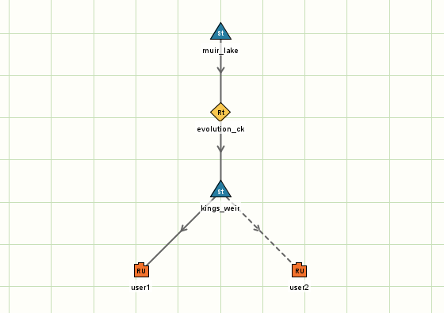

# Storage

## At a glance…

Storage nodes represents lakes, weirs, dams, or other reservoirs. Upstream flows accumulate in the storage and flows are passed downstream either via a spillway or regulated outlet. Each storage has 1 spillway, which overflows according to a level-flow relationship when the level of water in the storage exceeds the spillway crest. Regulated outlets allow for regulated downstream releases. Water in storages may be subject to evaporation, rainfall, and seepage.

```ini
[node.my_storage_node]
type = storage
loc = 20, 30
rain = data.climate_data_csv.by_name.rainfall
evap = data.climate_data_csv.by_name.mpot
seep = 0.82
dimensions = Level [m], Volume [ML], Area [km2], Spill [ML],
             80.0,      0,           0,          0,
             90.0,      1000,        2,          0,
             90.1,      1010,        2,          1e8,
             90.2,      1020,        2,          1e8
ds_1 = my_other_node
```

## Node properties

| Property | Description |
| --- | --- |
| [node.?] (compulsory) | Start of node declaration. This says we are creating a node, and also defines the name of the node. Node naming conventions are discussed at . Example: `[node.my_inflow_node]` |
| type (compulsory) | The node type, which is “storage” in this case. `type = storage` |
| loc (compulsory) | The location of the node in cartesian coordinates.  Example: `loc = 20, 30` |
| rain (optional) | Rainfall data [mm]. Default is zero. Example: `rain = data.rex_rain_csv.by_name.value` |
| evap (optional) | Potential evapotranspiration data [mm]. Default is zero. Example: `evap = data.rex_mpot_csv.by_name.value` |
| seep (optional) | Seepage rate [mm]. Default is zero. Example: `seep = 0.82` |
| initial\_volume (optional) | Initial volume [ML]. Default is zero. Example: `initial_volume = 14000` |
| order\_through (optional) | Optional boolean flag changing the ordering behaviour of the node such that downstream orders are propagated upstream verbatim. This functionality is explained in detail further down this page. Default is false. Example: `order_through = true` |
| target\_level (optional) | Optional target level [m] which causes this storage node to generate orders to operate the storage near the target level. This functionality is explained in detail below. This feature cannot be used in combination with `order_through`.  Example: `target_level = if(sim.month>8, 8.0, 9.5)` |
| pond\_demand (optional) | Optional on-pond demand [ML]. Example: `pond_demand = 15.0 * data.patterns_csv.by_name.amenities` |
| dimensions (compulsory) | A tabulated list of values: level (m), volume (ML), area (km2), spill (ML/timestep). See [Table parameters](parameter-types.md) to find out more about how table parameter types work in Kalix. Example: `dimensions = 90, 0, 0, 0, 91, 100, 1, 0, 91.1, 101, 1, 1e8, 92, 102, 1, 1e8` |
| ds\_1\_outlet, ds\_2\_outlet, ds\_3\_outlet, ds\_4\_outlet (optional) | This allows you to specify the properties of outlets on each of the corresponding links (ds\_1, ds\_2, etc). At the moment just one outlet property is supported, being the minimum operating level (MOL) of the outlet. Notes: (1) Orders on ds\_1 may be partly or fully met by unregulated spills. (2) There are no spills on the other links. (3) If outlet properties are not defined the outlet on this link is assumed to be active and unlimited limit. Example: `ds_1_outlet = 81.1` |
| ds\_1 (optional) | Name of the downstream node. This property defines a downstream link. Inflow nodes may only have 1 downstream link.  Example: `ds_1 = my_other_node` |
| ds\_2, ds\_3, ds\_4 (optional) | Additional link used to represent regulated flow pathways separate to the main downstream link. `ds_2 = tws_pipline` |

## Results associated with this node

| Result | Description |
| --- | --- |
| dsflow | Downstream flow [ML] |
| usflow | Upstream flow [ML] |
| rain | Input rainfall [mm] |
| evap | Input evapotranspiration [mm] |
| seep | Input seepage [mm] |
| rain\_vol | Rainfall volume [ML] |
| evap\_vol | Evaporation volume [ML] |
| seep\_vol | Seepage volume [ML] |
| pond\_demand | On-pond demand [ML]. |
| pond\_diversion | Diversion associated with the pond demand [ML] |
| ds\_1, ds\_2, etc | Downstream flow [ML] on link ds\_1 (outlet + spill), ds\_2 (outlet), |
| ds\_1\_order | Order on link ds\_1 [ML] (also available for other links) |
| ds\_1\_spill | Flow over the spillway to ds\_1 [ML] (also available for other links, but = 0) |
| ds\_1\_outlet | Flow through the outlet to ds\_1 [ML] (also available for other links) |
| volume | Volume of water in the storage at the end of the timestep [ML] |
| level | Level of water in the storage at the end of the timestep [m] |
| area | Area of the water surface at the end of the timestep [km2] |

## How the node works

### Solver

Storages are simulated using the Backward Euler method. The defining characteristic of this method is that the rates-of-change during the timestep are functions of the end-of-timestep state. That is to say, the storage volume is determined such that the fluxes are consistent with the storage volume `vi` (and area `ai` and level `li`) at the end of the timestep:

- spill → `si=s(li)`

- pond evaporation → `ei=Mlake i×ai`

- pond rainfall → `ri=Pi×ai`

- seepage → `wi=Wi×ai`

- inflow → `qin,i=previously calculated`

- regulated releases → `qout,i=previously calculated`

Mass balance over the timestep is:

`Vi=Vi−1−si−ei+ri+qin,i−qout,i`

### Storages ordering upstream

The default behaviour of storages is to NOT propagate any orders upstream. However, storages can be configured to order upstream in either of two ways: (1) using the `target_level`, or (2) using the `order_through` property.

**Target level**

A storage configured with a `target_level` will operate to satisfy downstream orders to the best of its ability (same as without a target level), but while doing so will also generate its own orders requesting water from upstream as needed to bring its level up to the specified target. In practice, operating targets help operators ensure that sufficient water is available where needed for smooth operation. Target\_level serves the same purpose in the model.



Ordering to meet a `target_level` is imperfect. In the example above, ‘**kings\_weir**’ may not be able to precisely achieve a defined target level because:

- lag on ‘**evolution\_ck**’ could mean water ordered from ‘**muir\_lake**’ does not arrive immediately, and

- the target level may have changed in that time,

- rainfall, evaporation, and seepage may have happened in that time,

- ‘**user1**’ and ‘**user2**’ may have placed orders to ‘**kings\_weir**’ which should be released immediately.

Storages using the `target_level` property calculate orders as follows:

`Oupstream=max(0,Vtarget−Vestimated future)`

The term `Vtarget` is evaluated each timestep and is what we are trying to achieve by sending the current order. This is the target we are hoping to achieve when our order arrives, i.e. after n\_timesteps = upstream order travel time. The term `Vestimated future` is an estimate of the future storage volume after n\_timesteps if there were no inflows. Kalix uses a simple and conservative estimate of this:

`Vestimated future=Vnow−qout known+qin expected=Vnow−Ods today+Oupstream enroute`

**Order through**

When a storage is set with `order_through = true`, the storage will pass orders from the downstream link(s) to the upstream link(s) verbatim. Doing this means that downstream orders are really being satisfied from the upstream storage. This may change the ordering travel time perceived by regulated users.

The storage with `order_through = true` operates to release orders for downstream users as they come through. The volume in such a storage depends on the balance of inflows and outflows, and proper functioning may may depend on unregulated flows to cover losses and delivery inefficiencies.

---

## See also

[Inverted Pyramid Storage Tables](storage-tables.md)

## References

None.
