# Kalix IDE

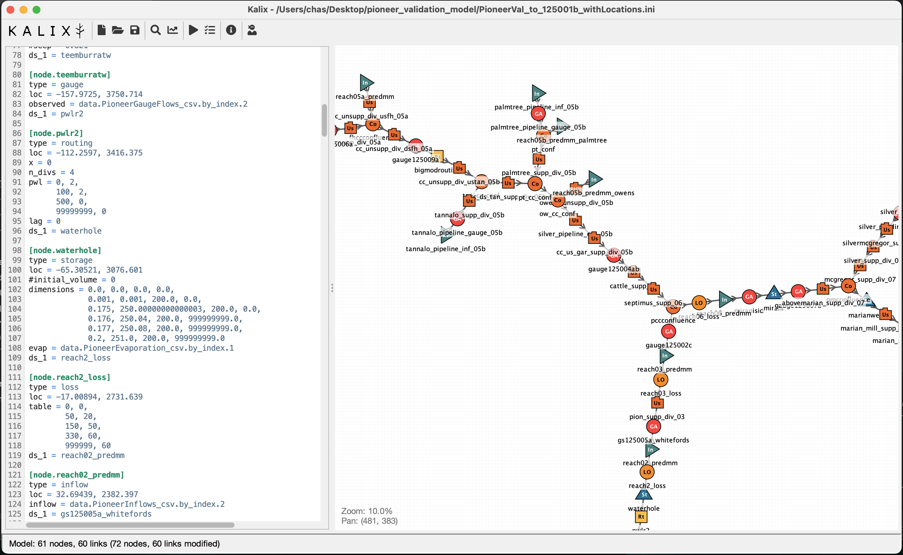

## Interactions

**Rename node** from the schematic map context menu

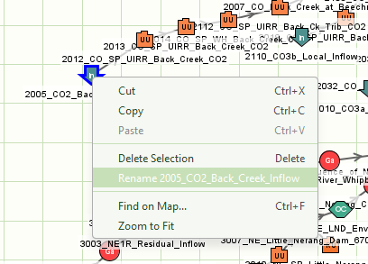

Model editor context menu item **Show on Map** will select and centre the node you’re working on in the schematic map

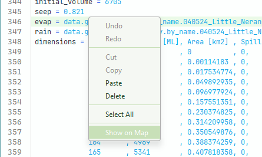

Click and drag to select nodes on the schematic map. Then drag to move or ctrl+drag to rotate.

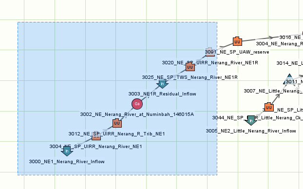

Ctrl+f in the model editor for **find**, or Ctrl+h for **find-and-replace**

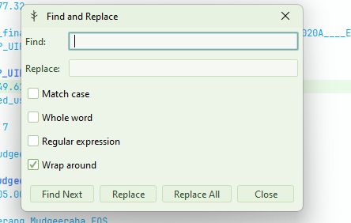

**Navigate Back** and **Navigate Forward** allow you to move between locations you have visited in the model text. Keyboard shortcuts make this faster.

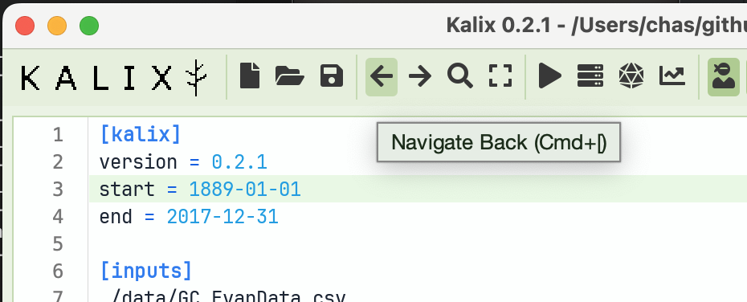

**Table View** for node parameters that accept tabular values. Find this in the editor’s context menu, or by using the shortcut Ctrl+t.

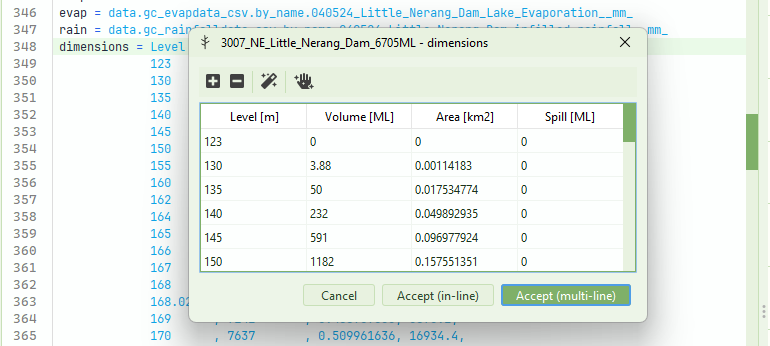

**Copy Location** by right-clicking your desired location on the map and using the context menu item.

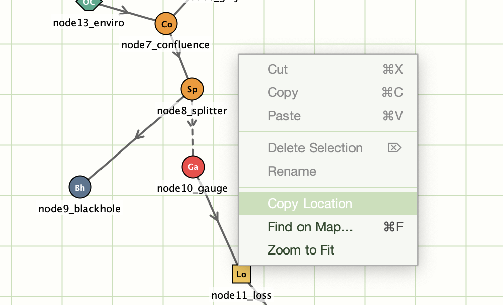

Use the **Navigate Back** and **Navigate Forward** buttons to flick back and forth between locations you have visited in the model file.

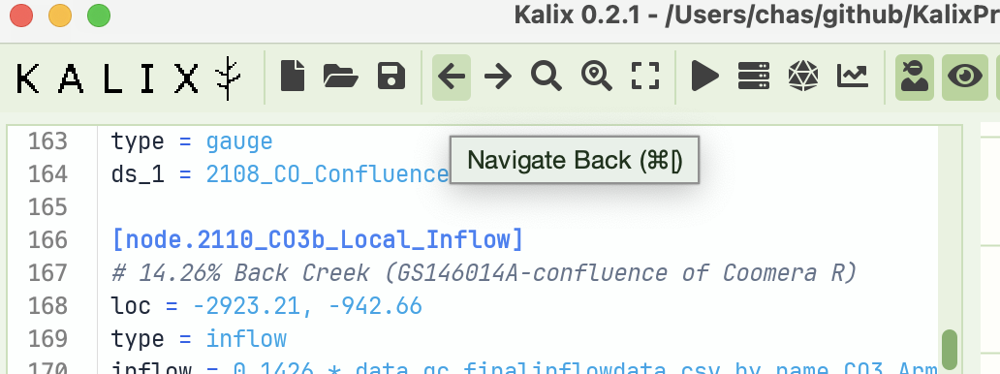

**Undo/redo in plots**! Buttons in the Run Manager’s plotting toolbar allow you to undo and redo your plotting actions (data selection, zoom, plot type).

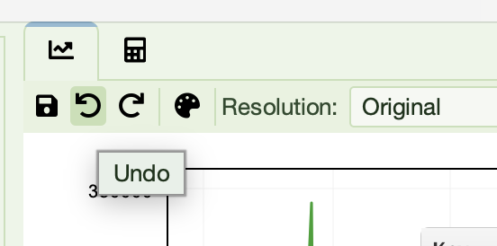

**Shift + click + drag to zoom** into a specific part of the plot using the mouse. This rectangular lasso zoom is handy for focusing in specific events in the hydrograph.

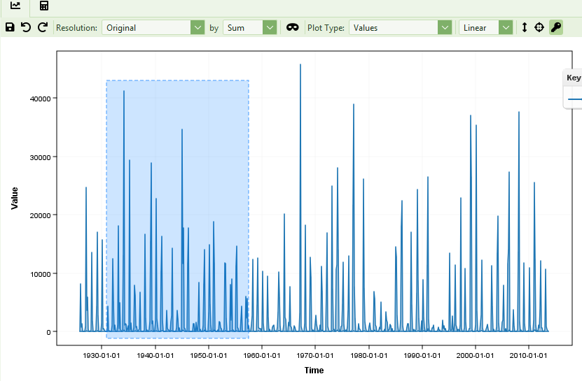

The **Parameter Sheet** shows node properties in a table. Filter by node type and name. Great for model review or bulk edits. Find it in the Tools menu.

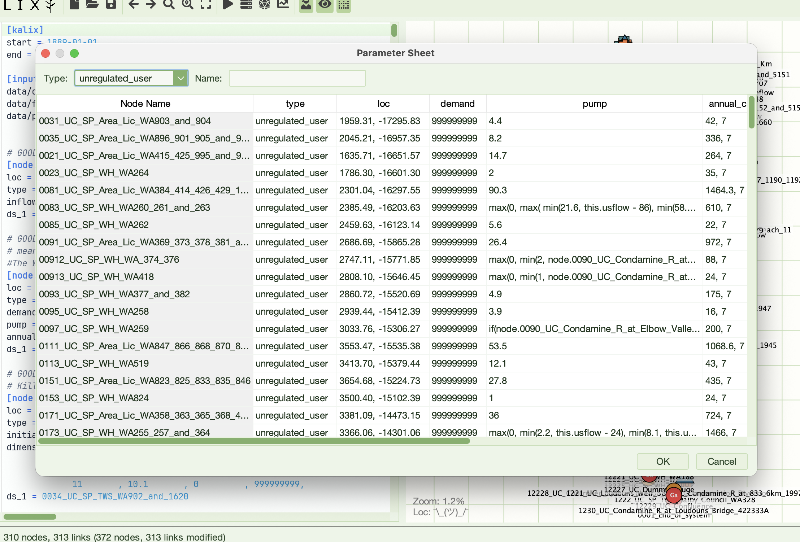

**Auto-complete** is accessible from the context menu, or the ctrl+space keyboard shortcut. Suggestions include data references and model result references. The list filters as you type and is context aware.

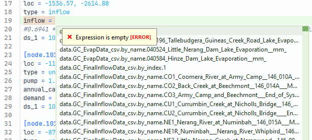

**Cut/copy/paste** nodes in the schematic map using the context menu or keyboard shortcuts. Paste will paste nodes onto the schematic at the coordinates where you opened the context menu. These will appear in the text-based model representation immediately below the section where the cursor currently is. (If you want to paste below a specific node, click on that node to place the cursor there before pasting).

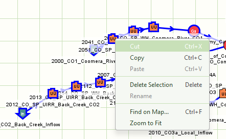

Ctrl+f to **Find node** on map. This is also available from a button in the toolbar.

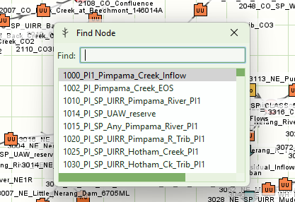

**Linting** warnings and errors highlight issues with the model file before runtime

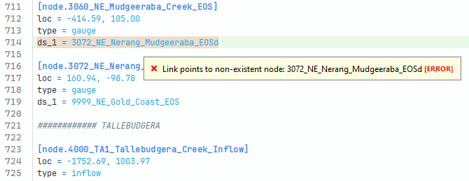

**Undo and redo**, right out of the box ;)

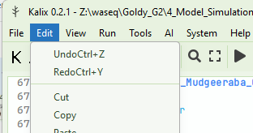

Right-click on a downstream link and use **Go to Node Definition** to navigate there with one click.

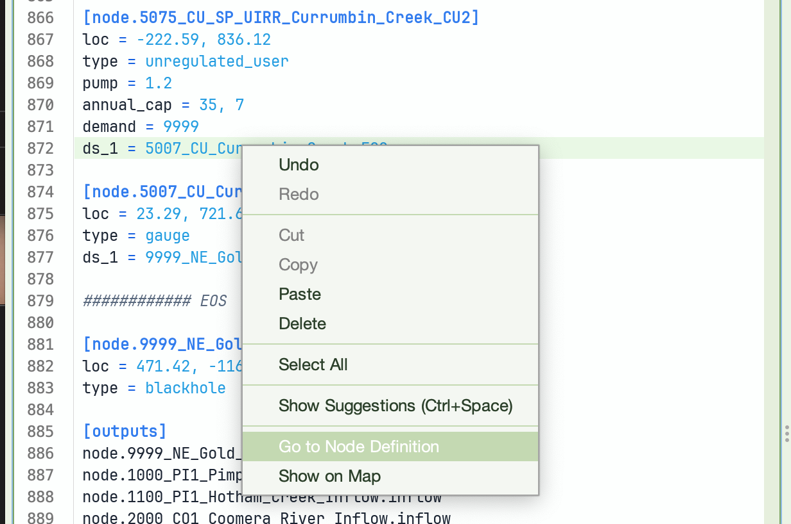

If you’re inside a terminal and want to edit a model, you can **launch the IDE from the terminal** and pass in the name of the model file.

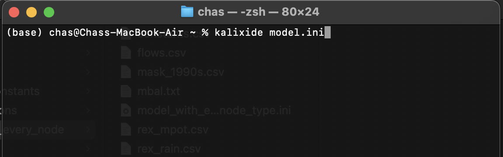

Look for the **Plot Palettes** button in the plotting tool create custom colour palettes. And click the line sample in the key to change the colour and style of a given line.

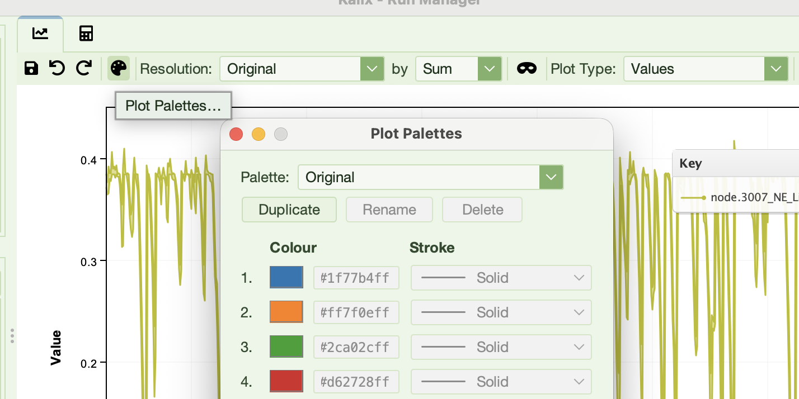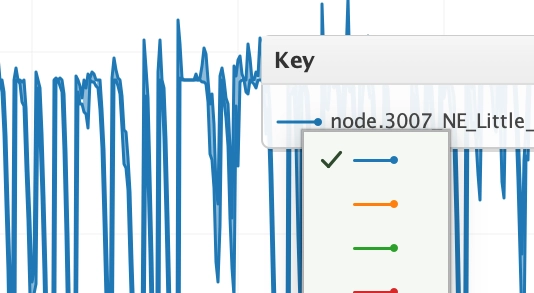

## Themes

Themes can be independently set for the Editor Syntax, Node Palate and the Application Window.

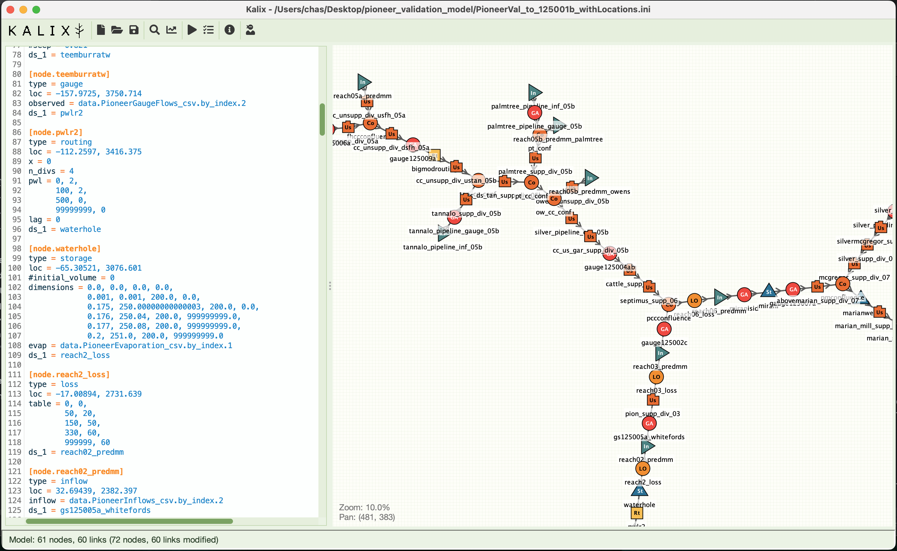

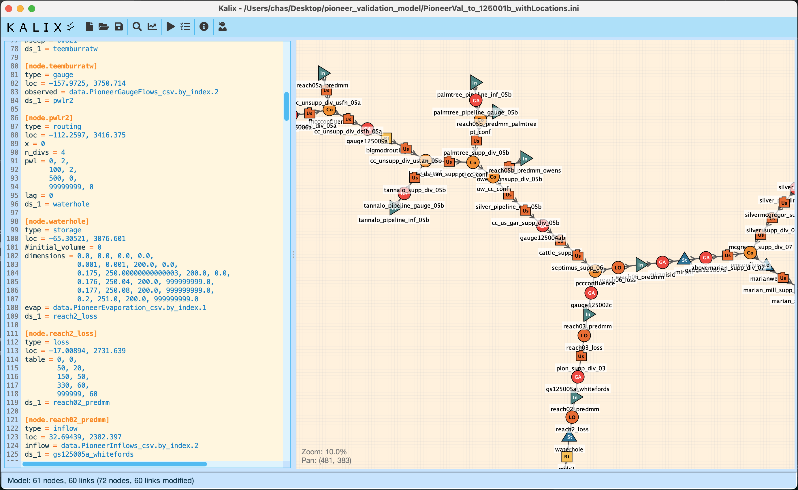

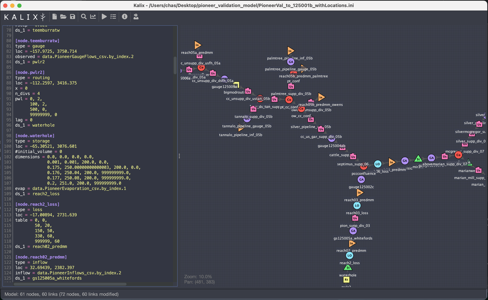

## Run Manager

It is a run manager. Yes.

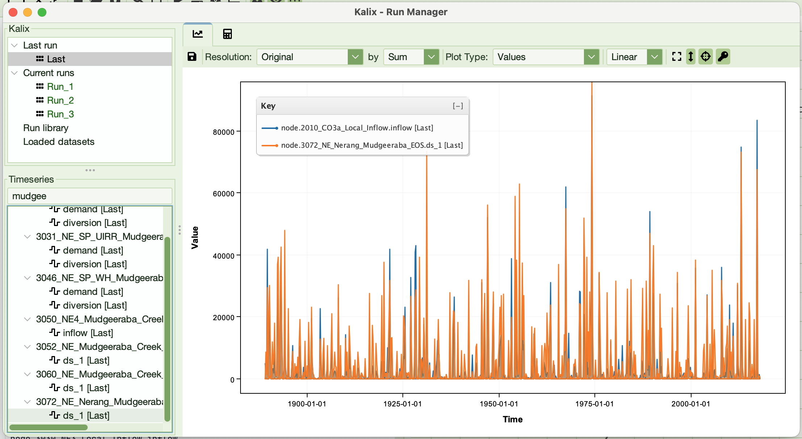

## Docking

Fn+F9 reveals docking capabilities in the main window. Holding Fn+F9, look for the blue handles that appear in the top left of the schematic editor and text editors. This feature is in alpha. Good luck 😄.

## KalixIDE Preferences

Preferences are automatically saved in the preference file, which lives in the `./app/kalix_prefs.json` file relative to your KalixIDE executable. Some of these are configurable at File > Preferences, while others are simply settings remembered from your last session.
