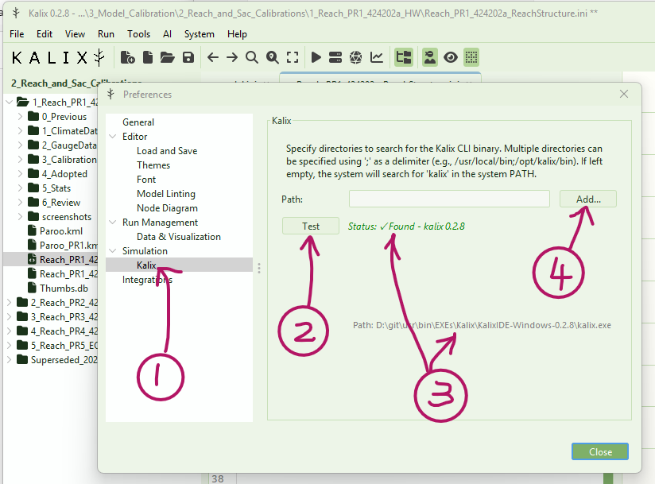

# Specifying the Kalix binary path in KalixIDE

**KalixIDE** depends on the **kalix** CLI program (i.e. “kalix.exe” in windows) for many things, including running models. You can specify the path to the kalix binary you want by:

1. Open KalixIDE and go to “File” > “Preferences” > “Simulations” > “Kalix” section. This is where the you can specify where KalixIDE should look to find the kalix CLI program.

2. By default, KalixIDE will look in its local path. Press the “Test” button to check if KalixIDE can find the CLI program.

3. If KalixIDE can find the CLI program can be found, it will show you a green tick, and what version it found, and the location. If you are happy with the version, you’re good to go!

4. If KalixIDE cannot find the CLI program, you can click the “Add” button to locate it yourself. After you have done this, press the “Test” button to confirm the connection. This will be saved in your user preferences file so you shouldn’t have to do it every time.

