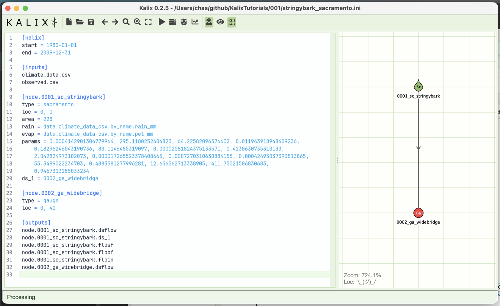
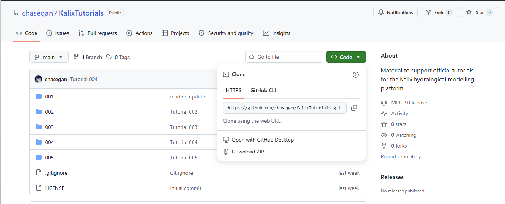
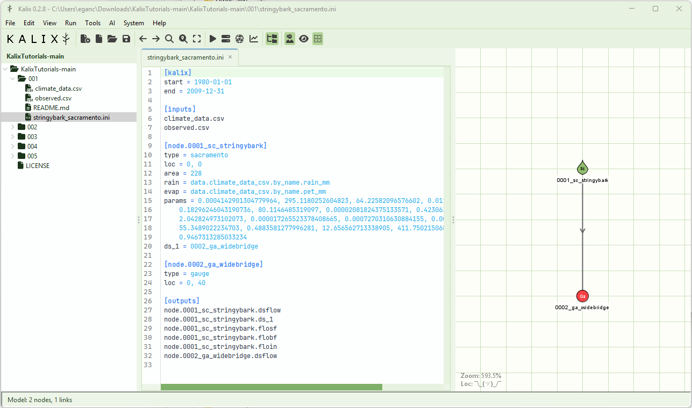
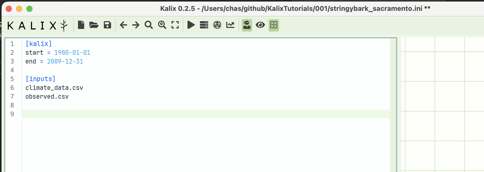
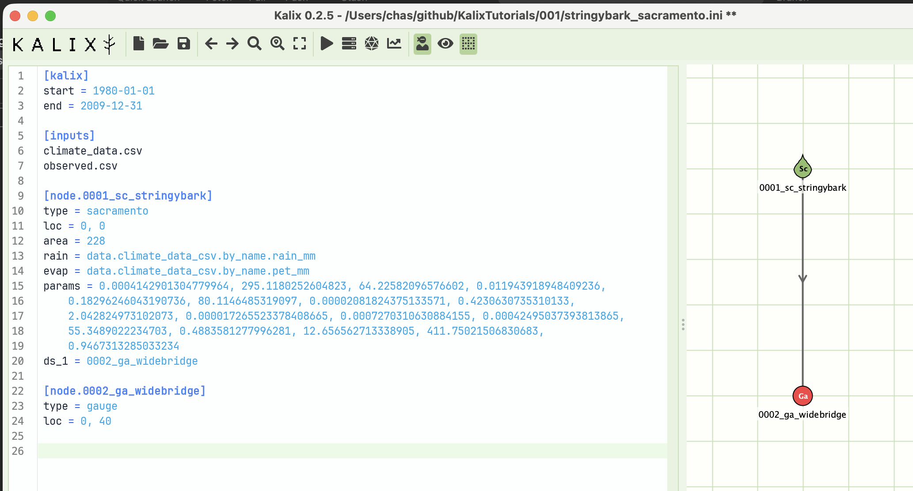
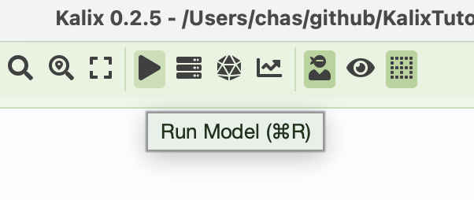
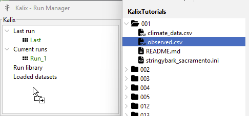
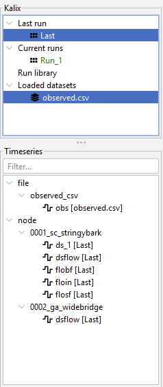
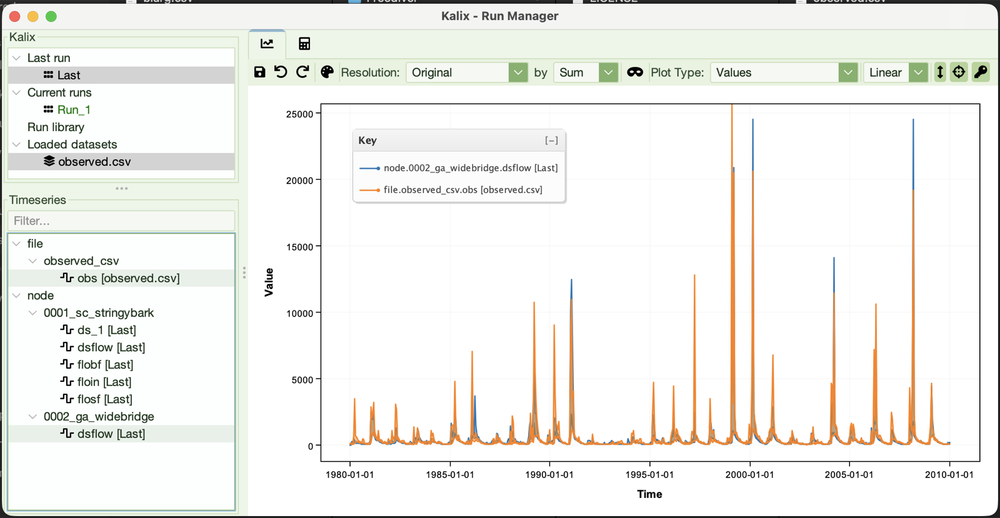
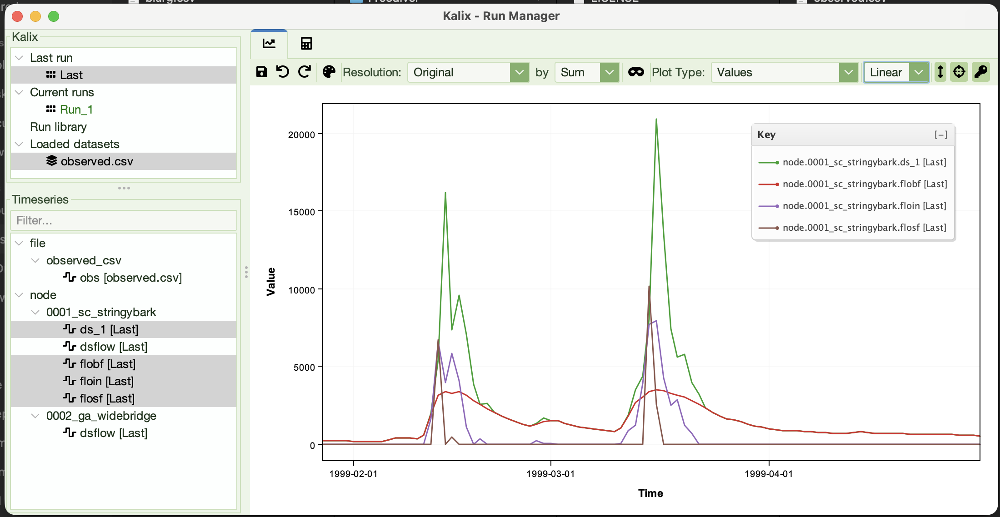

# Tutorial 1 — Your first model

**Tutorial 1 of the Kalix tutorial series.** You'll build a single-catchment rainfall-runoff model from scratch, run it, and look at the result. Expected time: about 20 minutes.

## What you'll build

A daily rainfall-runoff model for the (fictional) Stringybark Creek catchment — a Sacramento catchment node feeding a downstream gauge node, driven by ~30 years of daily rainfall and PET data. By the end you'll have a working model file, a simulation, and a chart of simulated vs. observed streamflow.



## Prerequisites

- **Kalix software** and the **Tutorial files** —
  1. Download Kalix from the [Downloads](../downloads.md) page. Unzip the bundled software to a suitable place on your computer and double click “KalixIDE.exe” to launch it.
  2. You may want to check/set the kalix engine by following the instructions on this page: [Specifying the Kalix binary path in KalixIDE](../docs/kalix-binary-path.md).
  3. Next you will need the tutorial files. Go to the KalixTutorials repository on GitHub: <https://github.com/chasegan/KalixTutorials>. Click the green “Code” button and find the option that says “Download ZIP”. Unzip the tutorial material somewhere suitable. Open this folder in KalixIDE by clicking “File” > “Open Folder…”.

- For this tutorial you will need the `001/` folder. You'll need:
  - `climate_data.csv` — daily rainfall and potential evaporation (mm/day)
  - `observed.csv` — observed streamflow at the gauge (ML/day)
  - Put both CSVs in the same folder. We'll build the model file (`stringybark_sacramento.ini`) from scratch in that same folder.

## About the dataset

The dataset is a daily time series covering 1980-01-01 to 2009-12-31 (30 years) for a fictional catchment we'll call **Stringybark Creek**, with a contributing area of **228 km²**. Each CSV has a `Date` column plus one or more value columns. Here, `climate_data.csv` carries two value columns (`rain_mm` and `pet_mm`) while `observed.csv` carries one (`obs`).

## Build the model

We'll build `stringybark_sacramento.ini` one section at a time. Open Kalix IDE and create a new empty model file in the same folder as the two CSVs.

### Step 1 — The `[kalix]` section

The `[kalix]` section holds top-level model settings. We'll use it to lock the simulation period to the 30 years our data covers.

```ini
[kalix]
start = 1980-01-01
end = 2009-12-31
```

If you leave `start` and `end` out, Kalix will infer the simulation period from the available input data. Setting them explicitly is good practice — it documents your intent and lets you simulate a sub-period without touching the data files.

### Step 2 — The `[data]` section

The `[data]` section lists the data files the model will load. Bare filenames are resolved relative to the model file's folder, which is what we want here.

```ini
[data]
climate_data.csv
observed.csv
```

A single CSV can hold any number of value columns, so the count of files you list here doesn't dictate how many inputs your model can wire up. Here `climate_data.csv` carries both the rainfall and PET series; we'll wire each column up to the right input on the node in the next step.



### Step 3 — A Sacramento catchment node

Now the heart of the model: a Sacramento rainfall-runoff node. The Sacramento Soil Moisture Accounting model takes daily rainfall and potential evaporation and produces a streamflow time series at the catchment outlet.

```ini
[node.0001_sc_stringybark]
type = sacramento
loc = 0, 0
area = 228
rain = data.climate_data_csv.by_name.rain_mm
evap = data.climate_data_alias.by_name.pet_mm
params = 0.0004142901304779964, 295.1180252604823, 64.22582096576602, 0.011943918948409236,
    0.18296246043190736, 80.1146485319097, 0.00002081824375133571, 0.4230630735310133,
    2.042824973102073, 0.000017265523378408665, 0.0007270310630884155, 0.00042495037393813865,
    55.3489022234703, 0.4883581277996281, 12.656562713338905, 411.75021506830683,
    0.9467313285033234
ds_1 = 0002_ga_widebridge
```

Line by line:

- `[node.0001_sc_stringybark]` — declares a node with the name `0001_sc_stringybark`. The name is yours to choose; it's how you'll refer to this node elsewhere in the model.

- `type = sacramento` — picks the node type. Sacramento is one of several rainfall-runoff models Kalix supports.

- `loc = 0, 0` — the x,y position of this node on the IDE's network canvas. Only the IDE uses it; the simulation doesn't care.

- `area = 228` — catchment area in km². Sacramento outputs are scaled by area to give volumetric flow.

- `rain = data.climate_data_csv.by_name.rain_mm` — wires the `rain` input of the node to the `rain_mm` column of `climate_data.csv`. The `data.<file>_csv.by_name.<column>` syntax is how Kalix references a named column inside a loaded CSV — note how the `.csv` extension becomes `_csv` in the reference.

- `evap = data.climate_data_csv.by_name.pet_mm` — same idea, this time pulling the `pet_mm` column from the same file.

- `params = ...` — the 17 Sacramento parameters. These were pre-calibrated for the tutorial dataset; we'll cover where they come from in the calibration tutorials.

- `ds_1 = 0002_ga_widebridge` — connects this node's first downstream link to a node called `0002_ga_widebridge`. We'll define that node in the next step; flow leaving the Sacramento node travels down this link to feed it.

As of kalix v0.3.1, input file aliases have been added, e.g.

```ini
[data]
climate_alias = climate_data.csv
```

Call on this alias by replacing the name of the file (`climate_data_csv`) with the alias, e.g.

```ini
[node.0001_sc_stringybark]
...
rain = data.climate_alias.by_name.rain_mm
```

### Step 4 — A downstream gauge node

A `gauge` node is a passive node: it doesn't modify the flow passing through, it just gives you a named point in the network where the streamflow can be inspected and recorded. Real-world gauges are physical streamflow measurement stations; gauge nodes are the modelling equivalent.

```ini
[node.0002_ga_widebridge]
type = gauge
loc = 0, 40
```

Line by line:

- `[node.0002_ga_widebridge]` — declares the gauge node. This is the node referenced by `ds_1` on the Sacramento node above.

- `type = gauge` — picks the node type. Flow passes through unchanged.

- `loc = 0, 40` — positions the node below the Sacramento node on the IDE's canvas.



### Step 5 — The `[outputs]` section

The `[outputs]` section lists the model results we want to record. We'll record flow at both nodes plus the three Sacramento runoff components.

```ini
[outputs]
node.0001_sc_stringybark.dsflow
node.0001_sc_stringybark.ds_1
node.0001_sc_stringybark.flosf
node.0001_sc_stringybark.flobf
node.0001_sc_stringybark.floin
node.0002_ga_widebridge.dsflow
```

These are:

- `node.0001_sc_stringybark.dsflow` — total downstream flow leaving the Sacramento node (ML/day).

- `node.0001_sc_stringybark.ds_1` — the flow going down the first downstream link, i.e. the link feeding the gauge. With only one downstream connection here, this matches `dsflow`.

- `node.0001_sc_stringybark.flosf` — surface runoff component (overland flow).

- `node.0001_sc_stringybark.flobf` — baseflow component (slow-release groundwater).

- `node.0001_sc_stringybark.floin` — interflow component (shallow subsurface flow).

- `node.0002_ga_widebridge.dsflow` — flow leaving the gauge node. Since gauges don't modify flow, this should equal the inflow it receives from upstream.

The Sacramento `dsflow` is the sum of the three runoff components (`flosf` + `flobf` + `floin`).

### The finished model file

Putting it all together, `stringybark_sacramento.ini` should look like this:

```ini
[kalix]
start = 1980-01-01
end = 2009-12-31

[data]
climate_data.csv
observed.csv

[node.0001_sc_stringybark]
type = sacramento
loc = 0, 0
area = 228
rain = data.climate_data_csv.by_name.rain_mm
evap = data.climate_data_csv.by_name.pet_mm
params = 0.0004142901304779964, 295.1180252604823, 64.22582096576602, 0.011943918948409236,
    0.18296246043190736, 80.1146485319097, 0.00002081824375133571, 0.4230630735310133,
    2.042824973102073, 0.000017265523378408665, 0.0007270310630884155, 0.00042495037393813865,
    55.3489022234703, 0.4883581277996281, 12.656562713338905, 411.75021506830683,
    0.9467313285033234
ds_1 = 0002_ga_widebridge

[node.0002_ga_widebridge]
type = gauge
loc = 0, 40

[outputs]
node.0001_sc_stringybark.dsflow
node.0001_sc_stringybark.ds_1
node.0001_sc_stringybark.flosf
node.0001_sc_stringybark.flobf
node.0001_sc_stringybark.floin
node.0002_ga_widebridge.dsflow
```

## Run it

Save the file. Hit the **Run** button in Kalix IDE (or use the Run menu).



The simulation should finish in a fraction of a second.

## Look at the output

The Run Manager window should open to a blank chart view. In order to plot `node.0002_ga_widebridge.dsflow` against the `obs` column of `observed.csv`, we must first load the data into the Run Manager. To load `observed.csv`, click and drag it from either your system file explorer or the KalixIDE file tree into the run manager window:



Once loaded, verify that it appears in the “Loaded datasets” dropdown menu. Next, click the “Last” run icon, hold Ctrl/Cmd to select multiple data sources, and then click `observed.csv` under “Loaded datasets”. Your Kalix and Timeseries panes should look like this:



You can now click the outputs (hold Ctrl/Cmd to select multiple timeseries) to plot `node.0002_ga_widebridge.dsflow` against the `obs` column of `observed.csv`. The Widebridge gauge sits at the catchment outlet, so its flow record is what you'd compare against the observed gauge data.



Try zooming and manipulating the plot window. A few specific interactions to try:

- Hold shift and drag to zoom in on a window.

- Double click to reset the zoom window.

- Try the controls along the top of the graph, particularly the three buttons on the right.

Try also plotting the three Sacramento flow components (`flosf`, `flobf`, `floin`) together. You'll see that:

- baseflow (`flobf`) is the steady background contribution

- surface flow (`flosf`) is the spiky response to storms

- interflow (`floin`) sits in between, draining off after wet periods



## What to try next

Small experiments to build intuition. Change one thing at a time and re-run.

1. **Change the catchment area** — set `area = 114` (half of the original value) and observe how `node.0001_sc_stringybark.dsflow` scales. Note: You can click multiple runs to compare the flow volumes on the same plot.

2. **Change the simulation period** — set `start = 2000-01-01` to run only the last 10 years. Useful when you're iterating on parameters and want fast feedback.

3. **Tweak a parameter** — the 6th parameter (`80.1146…`) is Sacramento's lower-zone tension water capacity. Halve it and re-run; the catchment should saturate more easily and respond faster to rainfall.

4. **Inspect the link** — add `node.0002_ga_widebridge.usflow` to the outputs to record the flow arriving at the gauge from upstream. Plot it alongside `node.0001_sc_stringybark.dsflow` — the two series should overlay exactly, since the link between them doesn't modify flow.

## Where to go from here

Once you're comfortable with this two-node setup, the next tutorials cover the rest of the foundations before we tackle bigger models:

- **[Tutorial 2 — Expressions](02-expressions.md)** — apply mathematical expressions to your inputs (using rainfall as the example) and compare runs with the Run Manager's plotting tools.

- **Tutorial 3 — Relative paths and trailhead paths** — organise input data with portable path references that survive moving the model around.

- **Tutorial 4 — Running Kalix from the commandline** — drive Kalix from the CLI instead of the IDE.
