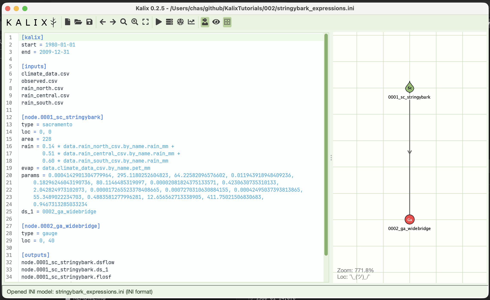
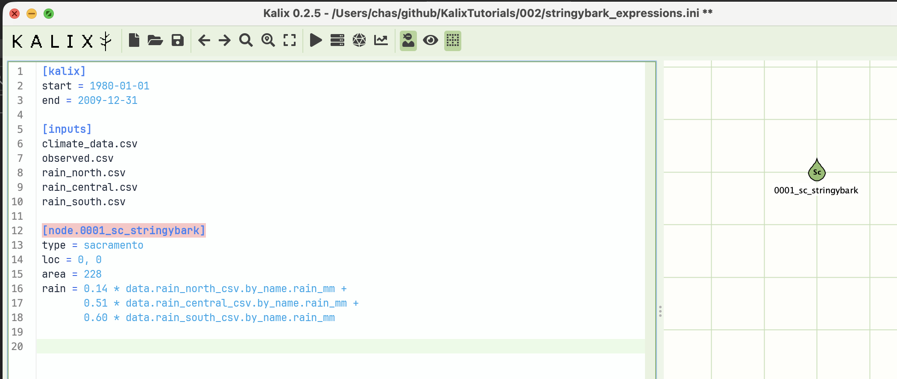
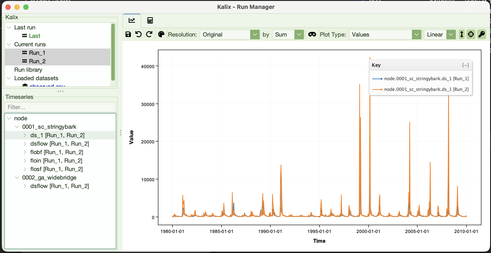
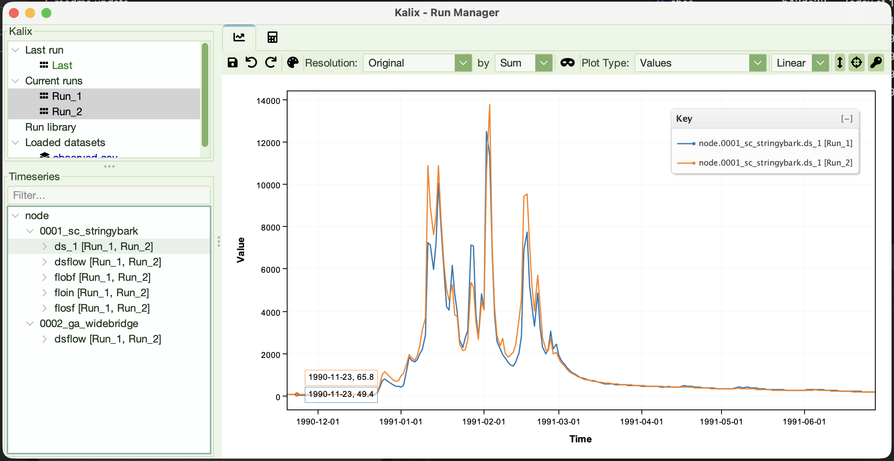
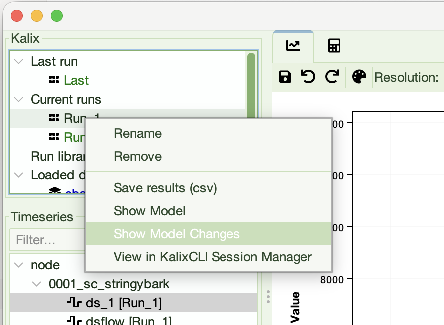
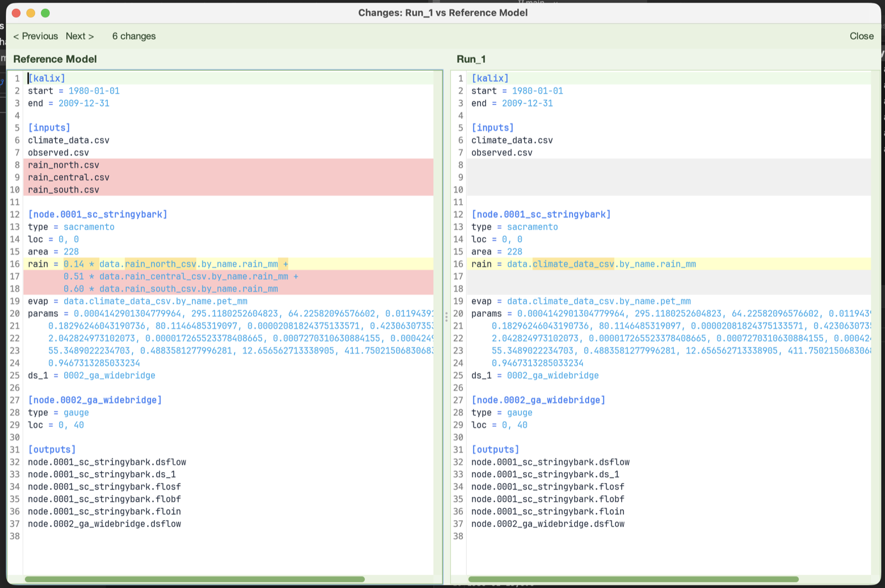

# Tutorial 2 — Expressions

**Tutorial 2 of the Kalix tutorial series.** You'll take the model from Tutorial 1 and rewrite its rainfall input as a weighted combination of three gauge stations, then compare runs side-by-side in the Run Manager. Expected time: about 15 minutes.

## What you'll build

The same Stringybark Creek catchment from Tutorial 1, but with the rainfall input rebuilt from three rain gauge stations instead of a single areal-rainfall series. The new rain is constructed inside the model file using a Kalix **expression** — a piece of arithmetic that combines data references and literal numbers.



## Prerequisites

- **Kalix software** and the **Tutorial files** — refer to [Tutorial 1 — Your first model](01-first-model.md).

- **Tutorial 1 complete** — refer to [Tutorial 1 — Your first model](01-first-model.md).

- **Tutorial files** — download the `002/` folder from the [KalixTutorials repository](https://github.com/chasegan/KalixTutorials/tree/main/002). You'll need:
  - `rain_north.csv`, `rain_central.csv`, `rain_south.csv` — daily rainfall at three stations around the catchment (mm/day)
  - `climate_data.csv` — same file as Tutorial 1; we'll only use the `pet_mm` column this time
  - `observed.csv` — same as Tutorial 1

Put all five CSVs in the same folder. We'll build the new model file (`stringybark_expressions.ini`) alongside them.

## About expressions

In Tutorial 1 you wrote `rain = data.climate_data_csv.by_name.rain_mm` — a direct reference to a single column. But that `=` is more powerful than it looks. **Most node properties that accept data actually accept a mathematical expression** rather than just a simple data reference.

The expression language is rich. It includes:

- **Data references** — `data.<file>_csv.by_name.<column>`, exactly as in Tutorial 1

- **Numeric literals** — plain numbers like `0.5`, `1.1`, `3.14`

- **Arithmetic operators** — `+`, `-`, `*`, `/`, `^` (power), with parentheses for grouping

- **Conditional logic** — `if(condition, true_value, false_value)` with comparison operators (`<`, `>`, `==`, …)

- **Common math functions** — `max`, `min`, `abs`, `sqrt`, `pow`, `log`, `sin`, `floor`, and many more

- **Model result references** — feed one node's output into another node's input

- **Simulation context variables** — the `sim.*` namespace exposes the current simulation date (`sim.year`, `sim.month`, `sim.day`, …), useful for time-of-year switching

A few quick examples to make this concrete:

- `rain = 1.1 * data.climate_data_csv.by_name.rain_mm` — scale rainfall up by 10% to simulate a wetter climate scenario.

- `evap = data.climate_data_csv.by_name.pet_mm * 0.95` — apply a 5% PET reduction.

- `inflow = 2.5 * data.upstream_csv.by_name.flow` — on an `inflow` node (a node type that injects flow at a point in the network), scale an upstream inflow series by 2.5×.

This tutorial focuses on the most common case — building a single rainfall input from multiple gauges.

For the full expression language reference, see [Dynamic Expressions](../docs/dynamic-expressions.md).

## Build the model

Open Kalix IDE and create a new model file called `stringybark_expressions.ini` in the same folder as the five CSVs. The fastest way is to copy your Tutorial 1 model file (`stringybark_sacramento.ini`) and rename the copy. The structure is identical except for two small changes below.

### Step 1 — Add the three station files to `[inputs]`

```ini
[inputs]
climate_data.csv
observed.csv
rain_north.csv
rain_central.csv
rain_south.csv
```

We've kept `climate_data.csv` so we can still pull `pet_mm` from it, and we've added the three new station files. The `rain_mm` column inside `climate_data.csv` is still loaded but we're about to stop referencing it.

### Step 2 — Replace the rain line with a weighted expression

In the Sacramento node, replace the old single-source rain line with this:

```ini
rain = 0.14 * data.rain_north_csv.by_name.rain_mm +
       0.51 * data.rain_central_csv.by_name.rain_mm +
       0.60 * data.rain_south_csv.by_name.rain_mm
```

What's happening:

- Three data references, one for each station, each pulling the `rain_mm` column.

- Each is multiplied by a numeric weight reflecting that station's relative contribution to the catchment's areal rainfall (think Thiessen-polygon weights).

- The products are summed with `+` to give the final rainfall driving the Sacramento model.

- The expression spans three lines for readability — Kalix joins any line beginning with whitespace onto the previous line, so the leading indent isn't just for looks; it's what tells the parser these three lines are one expression. The trailing `+` operators don't matter for continuation; they're just part of the arithmetic.

Note the weights don't need to sum to 1 — they're whatever you decide reflects each station's contribution. Here the sum (~1.25) means the combined rainfall is a bit heavier than any individual station, which is what you'd expect when stations cover overlapping parts of the catchment.



### The finished model file

The rest of the file is unchanged from Tutorial 1. Putting it all together:

```ini
[kalix]
start = 1980-01-01
end = 2009-12-31

[inputs]
climate_data.csv
observed.csv
rain_north.csv
rain_central.csv
rain_south.csv

[node.0001_sc_stringybark]
type = sacramento
loc = 0, 0
area = 228
rain = 0.14 * data.rain_north_csv.by_name.rain_mm +
       0.51 * data.rain_central_csv.by_name.rain_mm +
       0.60 * data.rain_south_csv.by_name.rain_mm
evap = data.climate_data_csv.by_name.pet_mm
params = 0.0004142901304779964, 295.1180252604823, 64.22582096576602, 0.011943918948409236,
    0.18296246043190736, 80.1146485319097, 0.00002081824375133571, 0.4230630735310133,
    2.042824973102073, 0.000017265523378408665, 0.0007270310630884155, 0.00042495037393813865,
    55.3489022234703, 0.4883581277996281, 12.656562713338905, 411.75021506830683,
    0.9467313285033234
ds_1 = 0002_ga_widebridge

[node.0002_ga_widebridge]
type = gauge
loc = 0, 40

[outputs]
node.0001_sc_stringybark.dsflow
node.0001_sc_stringybark.ds_1
node.0001_sc_stringybark.flosf
node.0001_sc_stringybark.flobf
node.0001_sc_stringybark.floin
node.0002_ga_widebridge.dsflow
```

## Run it

Save the file. Hit the **Run** button in Kalix IDE.

## Compare with Tutorial 1 in the Run Manager

Run both the Tutorial 1 and Tutorial 2 models in Kalix IDE, and open the **Run Manager**. Select both runs and use the Run Manager's plotting tool to overlay `node.0002_ga_widebridge.ds_1` from each. You should see two streamflow series that are visibly similar but not identical — the new rainfall (a weighted blend of three station series) produces a slightly different streamflow than the single areal-rainfall series in Tutorial 1.



Look at the overlay carefully. You'll likely see:

- Storm peaks shifted slightly in magnitude

- Recession limbs behaving differently after wet periods

- Year-by-year water-balance differences

Ask yourself: how has the average runoff changed? What does the flow-duration curve look like for each model?

You can also inspect the model-file changes that drove this difference. Right-click the Tutorial 1 run in the Run Manager and choose **"Show Model Changes"**. This opens a side-by-side diff between the model that produced the selected run (Tutorial 1's `stringybark_sacramento.ini`) and the model currently loaded in the editor (Tutorial 2's `stringybark_expressions.ini`). You should see two regions of difference:

- The `[inputs]` section, with the three new station files added

- The `rain = …` line, with the single-column reference replaced by the three-line weighted expression

The overlay above shows you *how* the simulated flow changed; "Show Model Changes" shows you *what changed in the model file* to make that happen.





## What to try next

Small experiments. Each one only changes the rain or evap expression.

1. **Equal weights** — try `(data.rain_north_csv.by_name.rain_mm + data.rain_central_csv.by_name.rain_mm + data.rain_south_csv.by_name.rain_mm) / 3`. This is the plain average of the three stations. Compare with the weighted version in Run Manager.

2. **Drop a station** — what if `rain_south` data was unavailable? Replace its term with `0.60 * data.rain_central_csv.by_name.rain_mm` to substitute the central station's series. How does that change the modelled flow?

3. **Scale PET for a warmer scenario** — change `evap = data.climate_data_csv.by_name.pet_mm` to `evap = 1.15 * data.climate_data_csv.by_name.pet_mm` (15% more evaporative demand). Compare in Run Manager.

4. **Use parentheses to group an expression** — wrap the weighted sum in parentheses and multiply by `1.1` to scale the combined rainfall up by 10%: `rain = 1.1 * (0.14 * data.rain_north_csv.by_name.rain_mm + 0.51 * data.rain_central_csv.by_name.rain_mm + 0.60 * data.rain_south_csv.by_name.rain_mm)`. Useful when you want to layer a climate-change factor over an existing combination of inputs.

## Where to go from here

- **[Tutorial 3 — Relative paths and trailhead paths](03-paths.md)** — your input files live in a folder. What happens when you move the model? How do you build models that travel cleanly with their data?

- **Tutorial 4 — Running Kalix from the commandline** — leave the IDE behind and drive Kalix from a terminal — the foundation for scripting and batch runs.
