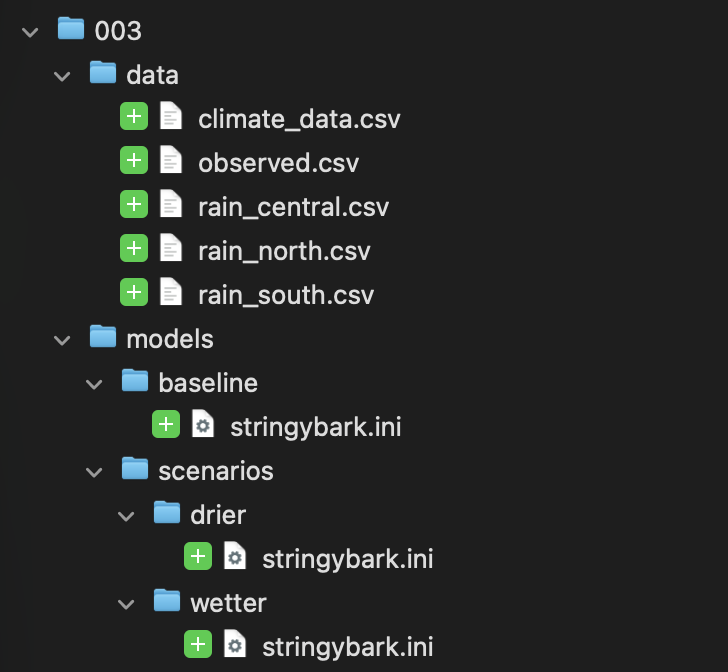
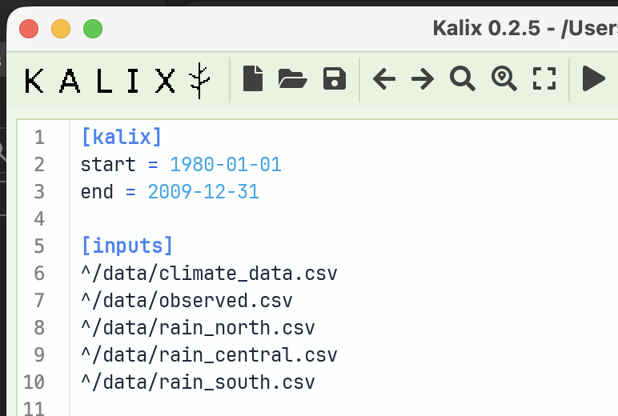
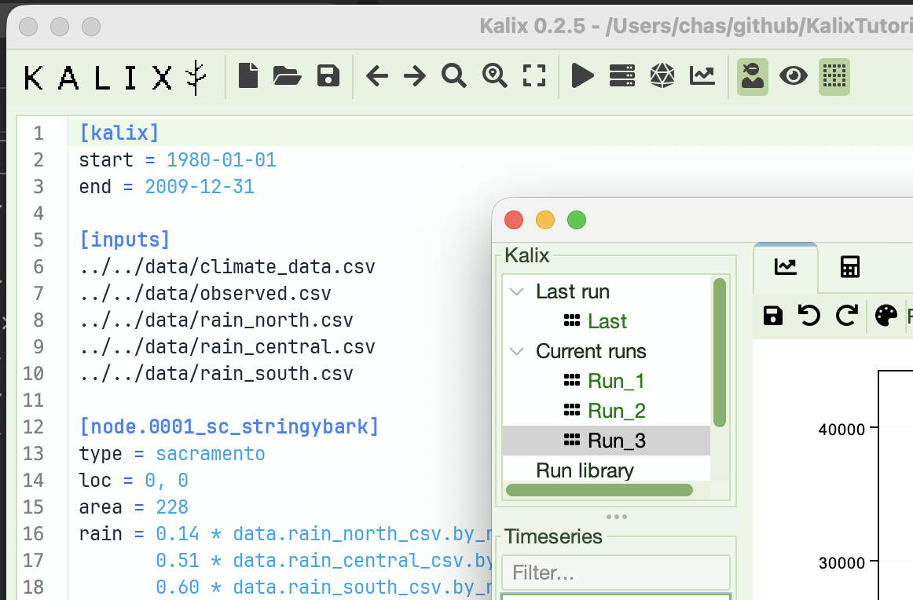
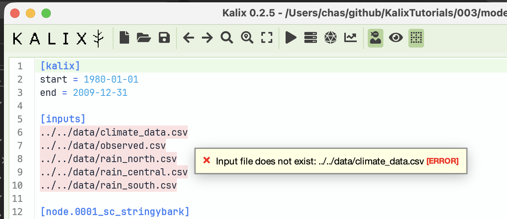
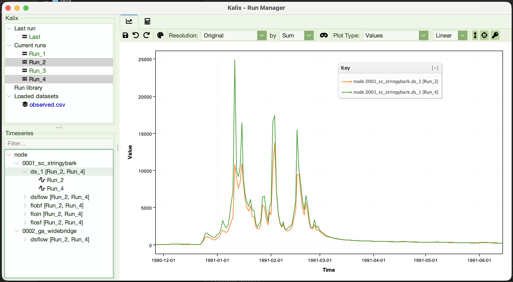

# Tutorial 3 — Relative paths and trailhead paths

**Tutorial 3 of the Kalix tutorial series.** You'll reorganise Tutorial 2's Stringybark model into a typical multi-folder project layout, add a wetter-climate scenario at a deeper folder, and switch from fragile relative paths to portable trailhead paths. Expected time: about 15 minutes.

# What you'll build

A small project with shared input data in one place and two model variants — a `baseline` and a `wetter` scenario — at different depths under a `models/` folder. Along the way you'll experience how relative paths break, and you’ll fix it once-and-for-all using Kalix's trailhead paths.





# Prerequisites

- **Kalix software** and the **Tutorial files** — refer to [Tutorial 1 — Build your first model](01-first-model.md).

- **Tutorials 1 & 2 complete** — see [Tutorial 1 — Build your first model](01-first-model.md) and [Tutorial 2 — Expressions](02-expressions.md). We'll build on Tutorial 2's model.

- **Tutorial files** — download the `003/` folder from the [KalixTutorials repository](https://github.com/chasegan/KalixTutorials/tree/main/003). It ships with this layout:

```
003/
├── data/
│   ├── climate_data.csv
│   ├── observed.csv
│   ├── rain_north.csv
│   ├── rain_central.csv
│   └── rain_south.csv
└── models/
    └── baseline/
        └── stringybark.ini
```

# The three path styles

Kalix accepts three styles of path in `[inputs]`:

| Style | Example | How it resolves |
| --- | --- | --- |
| **Absolute** | `/Users/chas/data/climate.csv` `C:/data/climate.csv` | Resolved exactly as written. Always points to the same place on this machine; never travels. |
| **Relative** | `../data/climate.csv` | Resolved against the folder the model file lives in. Travels as long as the folder structure around the model stays the same. |
| **Trailhead** | `^/data/climate.csv` | Starts at the model's folder and searches *upward* through parent folders until the target is found. Travels gracefully when models move to different depths. |

For the full reference on path syntax and resolution, see [Declaring Input Data](../docs/concepts/input-data.md).

# Step 1 — Run the baseline

Open `models/baseline/stringybark.ini` in Kalix IDE. The `[inputs]` section uses **relative paths** — each one starts with `../../` to step up out of `baseline/` and `models/`, then into `data/`:

```toml
[inputs]
../../data/climate_data.csv
../../data/observed.csv
../../data/rain_north.csv
../../data/rain_central.csv
../../data/rain_south.csv
```

Run the model. It works — the relative paths resolve correctly because `../../data/...` does in fact point at the data folder from where this model sits.



# Step 2 — Add a wetter-climate scenario

Now imagine you want to explore what happens if rainfall is 20% higher. The clean way to manage variants is to put each scenario in its own folder so files don't collide.

Create a new folder `models/scenarios/wetter/`, then copy `baseline/stringybark.ini` into it. Your tree should now look like:

```
003/
├── data/
│   └── …
└── models/
    ├── baseline/
    │   └── stringybark.ini
    └── scenarios/
        └── wetter/
            └── stringybark.ini   ← new copy
```

Open the new `models/scenarios/wetter/stringybark.ini` and change the rain line to scale the existing weighted sum by `1.2` (using the parentheses pattern from Tutorial 2's experiment #4):

```toml
rain = 1.2 * (0.14 * data.rain_north_csv.by_name.rain_mm +
              0.51 * data.rain_central_csv.by_name.rain_mm +
              0.60 * data.rain_south_csv.by_name.rain_mm)
```

# Step 3 — Watch the paths break

Try to run the wetter model.

It fails. Kalix tells you it can't find the input files. Why? The new file lives at `models/scenarios/wetter/`, which is *three* levels above `data/`, not two. The relative paths still say `../../data/...`, which from this deeper location now points to `models/data/` — a folder that doesn't exist.



# Step 4 — Two ways to fix it

## Option A — Patch the relative paths

You could change the wetter model's `[inputs]` from `../../data/...` to `../../../data/...` (one more `../` to climb the extra level):

```toml
[inputs]
../../../data/climate_data.csv
../../../data/observed.csv
../../../data/rain_north.csv
../../../data/rain_central.csv
../../../data/rain_south.csv
```

This works. But every time you add a deeper scenario folder, or move a model around, you have to re-count `../` segments and edit every line in `[inputs]`. The number of `../` segments depends on *where each model lives*, which is fragile.

## Option B — Switch to trailhead paths

The `^/` prefix turns the path into a **trailhead path** — Kalix starts at the model's folder and searches *upward* through parent folders until it finds the target. This means the same line works regardless of how deeply the model is nested.

Replace `../../` (or `../../../`) with `^/`:

```toml
[inputs]
^/data/climate_data.csv
^/data/observed.csv
^/data/rain_north.csv
^/data/rain_central.csv
^/data/rain_south.csv
```

Whether your model is at `models/baseline/` or `models/scenarios/wetter/sensitivity/`, the trailhead expression resolves to the same `data/` folder. You write it once and forget it.

# Step 5 — Apply trailhead paths to both models

Update the `[inputs]` section in **both** `models/baseline/stringybark.ini` *and* `models/scenarios/wetter/stringybark.ini` to use the trailhead form shown above. Save both files. Now both models share the same `[inputs]` block — literally the same five lines — even though they live at different depths.

# Run both and compare

Run the baseline. Run the wetter scenario. Both work, from any depth.

Open the **Run Manager** and overlay `node.0002_ga_widebridge.ds_1` from each run. You should see the wetter scenario's simulated flow sitting noticeably above the baseline's — the 1.2× rainfall multiplier you wrote into the wetter rain expression flows straight through to streamflow.



# What to try next

1. **Go deeper** — create `models/scenarios/wetter/sensitivity/stringybark.ini` (another copy of wetter). Same trailhead paths; same result. The deeper the nesting, the bigger the win over relative paths.

2. **Move the whole project up a level** — rename `003/` to something else, or move it under a different parent folder. Both models still run. Trailhead paths don't care where the project itself lives.

3. **Move the** `data/` **folder** — try moving `data/` from `003/data/` to `003/raw/data/`. Now the trailhead paths break. Update them to `^/raw/data/...` in one model and confirm it works.

4. **Mix and match** — leave one input as an absolute path, the rest as trailhead. Kalix happily mixes styles within a single `[inputs]` block.

# Where to go from here

- **[Tutorial 4 — Running Kalix from the commandline](04-commandline.md)** — drive Kalix from a terminal instead of the IDE. Foundation for scripting and batch runs.

- **[Tutorial 5 — Running Kalix from Python](05-python.md)** — wire Kalix into data-science notebooks for analysis and post-processing.
