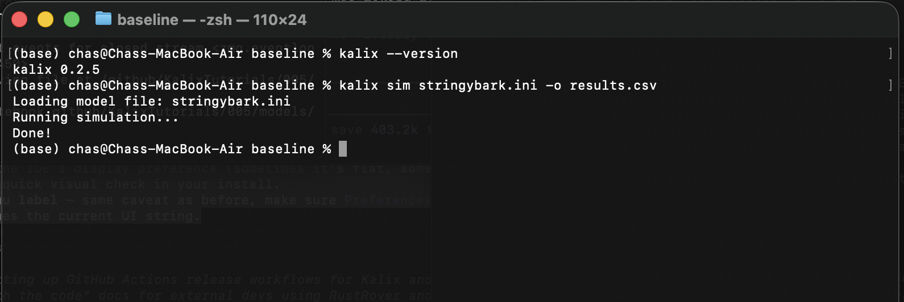
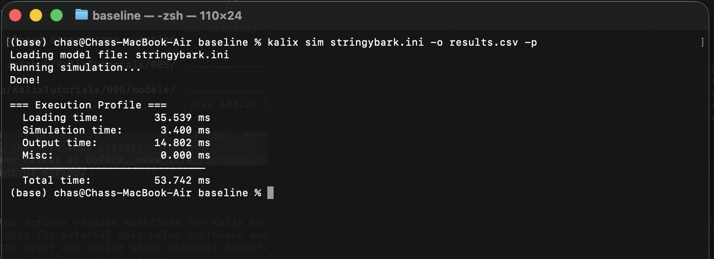

# Tutorial 4 — Running Kalix from the commandline

**Tutorial 4 of the Kalix tutorial series.** You'll drive a Kalix simulation directly from a terminal using the `kalix` command-line tool, learn its main flags, and chain runs together in a small shell loop. Expected time: about 15 minutes.

# What you'll build

A working CLI workflow for the Stringybark catchment model: running simulations from a terminal, choosing output formats, producing mass-balance check, profiling performance, and finally chaining multiple runs in a single shell loop.



# Prerequisites

- **Kalix software** and the **Tutorial files** — refer to [Tutorial 1 — Build your first model](01-first-model.md).

- **Tutorial 3 complete** — see [Tutorial 3 — Relative paths and trailhead paths](03-paths.md). We use the same project layout.

- **Kalix CLI added to PATH** — After downloading Kalix, add the location of the `kalix` binary to your path variable so you can call it from any folder.
  - **Windows**: Run the command `setx PATH "%PATH%;C:\path\to\kalix\exe"` from the command prompt. Restart the command prompt for changes to take effect.
  - **Mac and Linux**: Edit your `~/.bashrc` (for bash shells) or `~/.zchrc` (for zrc shells) file to include the following `export PATH="/path/to/kalix/binary:$PATH"`. Restart the command prompt for changes to take effect.
  - Verify by running the command `kalix --version` from a fresh terminal.

- **Tutorial files** — download the `004/` folder from the [KalixTutorials repository](https://github.com/chasegan/KalixTutorials/tree/main/004).

# Project layout

```
004/
├── data/
│   ├── climate_data.csv
│   ├── observed.csv
│   ├── rain_north.csv
│   ├── rain_central.csv
│   └── rain_south.csv
└── models/
    └── baseline/
        └── stringybark.ini   ← the model (uses trailhead paths)
```

Same layout as Tutorial 3 — just without the wetter scenario. All the commands below assume you've changed into `004/models/baseline/`.

# Step 1 — Verify the install

From any terminal, check that `kalix` is callable and the version is what you expect:

```bash
kalix --version
```

You should see something like `kalix 1.0.0`. If you get "command not found", the binary isn't on your PATH — revisit the install step or use the full path to the binary.

For the full command list, run:

```bash
kalix --help
```

You'll see the subcommands: `simulate` (alias `sim`), `optimise` (alias `opt`), `new-session`, `get-api`, `test`, `help`. We'll only need `simulate` in this tutorial.

# Step 2 — Run a basic simulation

From the `004/models/baseline/` folder, run:

```bash
kalix sim stringybark.ini -o results.csv
```

You should see three lines on stdout:

```
Loading model file: stringybark.ini
Running simulation...
Done!
```

The simulation finishes in well under a second. `results.csv` is now in the current folder — 6 columns (the same model outputs you saw in Tutorial 5) and 10,958 rows of daily data from 1980-01-01 to 2009-12-31.

The arguments worth knowing:

- `sim` — the subcommand; an alias for `simulate`

- `stringybark.ini` — the positional argument, the model file to run

- `-o results.csv` — the output file. The format is inferred from the extension

# Step 3 — Choose your output format

Kalix infers the output format from the file extension:

- `.csv` — a regular comma-separated file with a `Time` column and one column per output

- `.pxb` — Pixie, Kalix's native Gorilla-compressed format (a `.pxt` header file is written alongside the `.pxb` data file)

Swap the extension to switch formats:

```bash
kalix sim stringybark.ini -o results.pxb
```

For a tiny 30-year run like this one, the size difference is negligible, but for big simulations Pixie can be several times smaller and significantly faster to read back. See [Tutorial 5 — Running Kalix from Python](05-python.md) for an example of reading a Pixie file into pandas with `kalix.read_pixie()`.

# Step 4 — Mass balance report

Add `-m mbal.txt` to write a mass-balance report alongside the output:

```bash
kalix sim stringybark.ini -o results.csv -m mbal.txt
```

Open `mbal.txt`:

```
==================================
MASS BALANCE REPORT
==================================
  Node count: 2
  Timesteps: 10958
  Stepsize (s): 86400
  Period: 1980-01-01T00:00:00.000Z, 2009-12-31T00:00:00.000Z
  Note: units are ML/timestep

SACRAMENTO NODES
  0001_sc_stringybark, 418.1345202895963

GAUGE NODES
  0002_ga_widebridge, 0

----------------------------------
TOTAL = 418.1345202895963
----------------------------------
```

This is a sanity check on every node's flow accounting. Each node category lists each node's net mass contribution (in ML per timestep, averaged). The grand total at the bottom should generally be close to zero for a closed system; in this single-catchment model the Sacramento contributes runoff (positive) and the gauge passes it through, so the imbalance reflects the catchment's net runoff yield.

In larger systems with storages, users, and links, the mass-balance report is one of your best diagnostic tools for detecting modelling errors.

# Step 5 — Profile a run

Add `-p` to see where time is spent during the run:

```bash
kalix sim stringybark.ini -o results.csv -p
```

After the usual "Done!" line you'll get a timing breakdown:

```
=== Execution Profile ===
  Loading time:        23.313 ms
  Simulation time:      3.377 ms
  Output time:         15.042 ms
  Misc:                 0.001 ms
  ─────────────────────────────
  Total time:          41.733 ms
```

For a 30-year daily simulation, the simulation itself is a few milliseconds — the bulk of the time is loading the model and writing outputs. As models scale up (more nodes, more inputs, longer periods), the simulation share grows. This is exactly the kind of breakdown you want when investigating slowness on a big model.



# Step 6 (bonus) — Batch runs with a `.bat` script

The real payoff of the CLI is automating runs. We don't have a flag for overriding `start`/`end`, so we patch a temporary copy of the model for each iteration. Here's a Windows `.bat` script that runs the model six times with progressively-longer simulation periods — ending in 1985, 1990, 1995, 2000, 2005, and 2009 — writing one output file per scenario:

```bash
@echo off
for %%E in (1985 1990 1995 2000 2005 2009) do (
    powershell -Command "(Get-Content stringybark.ini) -replace 'end = 2009-12-31', 'end = %%E-12-31' | Set-Content _temp.ini"
    kalix sim _temp.ini -o results_%%E.csv
)
del _temp.ini
```

What each line does:

- `for %%E in (…) do ( … )` loops through the year list, with `%%E` bound to the current value each pass.

- The embedded `powershell -Command "…"` reads the model file, replaces the `end = 2009-12-31` line with the current loop year, and writes the patched result to `_temp.ini`.

- `kalix sim _temp.ini -o results_%%E.csv` runs the patched model and writes a per-year output file.

- `del _temp.ini` cleans up the scratch file at the end.

After the loop, you'll have six output files — each one a complete simulation clipped to a different end date. The pattern generalises: swap the PowerShell `-replace` for any text replacement to vary any model property across runs, and you have a batch processing pipeline.

# What to try next

- **Explore the simulate flags** — `kalix help simulate` prints every option, including `--verify-mass-balance` (next bullet).

- **Mass-balance regression checks** — `kalix sim stringybark.ini --verify-mass-balance mbal.txt` compares the run's mass balance against a previously-saved report. Useful in CI to catch unintended behaviour changes when refactoring models.

- **The JSON API spec** — `kalix get-api` dumps a machine-readable description of every command and flag, useful if you want to drive Kalix from another tool.

- **Optimisation** — once you have a calibration config file, `kalix opt config.ini stringybark.ini -s calibrated.ini` runs the built-in optimiser. We'll cover this in a future calibration tutorial.

# Where to go from here

- **[Tutorial 5 — Running Kalix from Python](05-python.md)** — drive Kalix from a Jupyter notebook for analysis and post-processing. The complementary skill to the CLI: CLI for batch and automation, Python for analysis.

For the full CLI reference (every command, every flag), see [Commandline](../using/cli.md).
