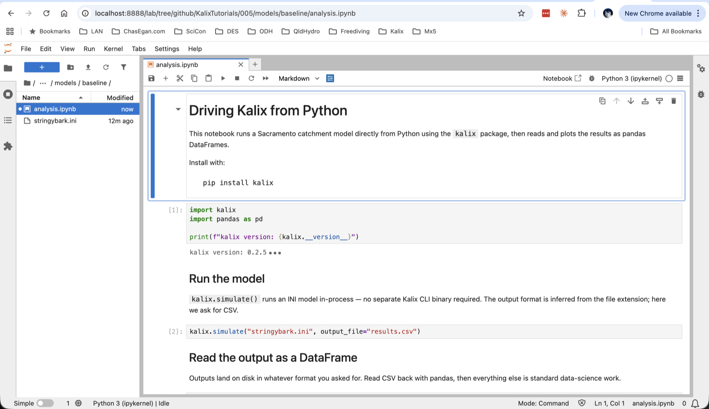
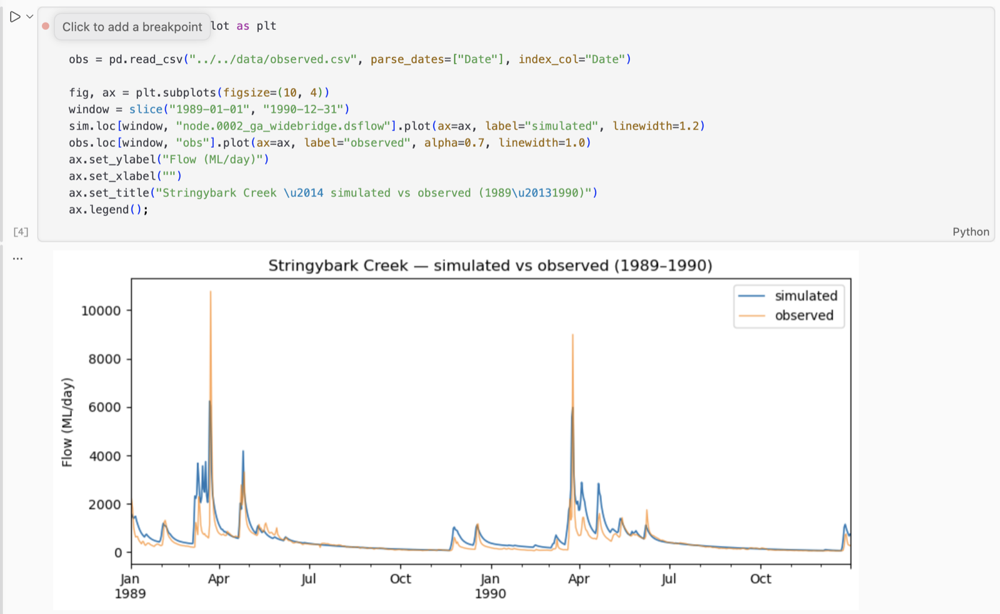
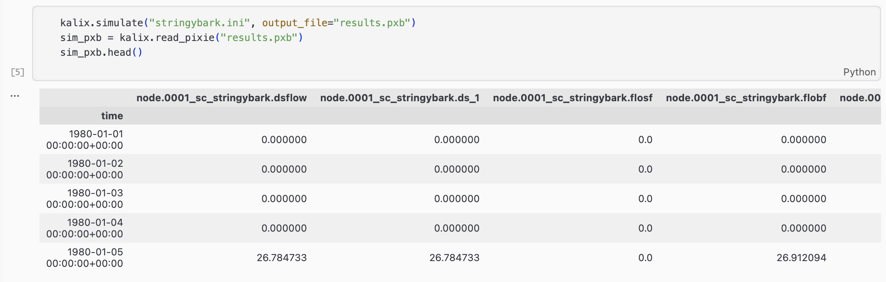

# Tutorial 5 — Running Kalix from Python

**Tutorial 5 of the Kalix tutorial series.** You'll drive a Kalix simulation directly from Python using the `kalix` package, read the outputs as pandas DataFrames, and plot them. Expected time: about 20 minutes.

## What you'll build

A Jupyter notebook that sits next to your model file and:

- Runs the simulation with one line: `kalix.simulate(...)`

- Reads the output into a pandas DataFrame

- Plots simulated vs observed flow

- (Bonus) Switches the output to Kalix's native Pixie format for faster, smaller files

This is the foundation for any analysis, scripting, or notebook-driven workflow built on top of Kalix.



## Prerequisites

- **Kalix software** and the **Tutorial files** — refer to [Tutorial 1 — Your first model](01-first-model.md).

- **Tutorial 3 complete** (or its concepts) — see [Tutorial 3 — Relative paths and trailhead paths](03-paths.md). We start from a project laid out the same way: shared `data/` with a model in `models/baseline/`.

- **Python 3.9 or newer** with Jupyter installed.

- **Tutorial files** — download the `005/` folder from the [KalixTutorials repository](https://github.com/chasegan/KalixTutorials/tree/main/005). The repo also ships a fully-worked `analysis.ipynb` if you'd rather skim than type along.

## Project layout

```
005/
├── data/
│   ├── climate_data.csv
│   ├── observed.csv
│   ├── rain_north.csv
│   ├── rain_central.csv
│   └── rain_south.csv
└── models/
    └── baseline/
        ├── stringybark.ini     ← the model (uses trailhead paths)
        └── analysis.ipynb      ← the notebook we'll write
```

The notebook sits **next to the model file**. That's deliberate — keep your scripts and analysis alongside the artefact they operate on so relative paths stay simple.

## Step 1 — Install the `kalix` package

```bash
pip install kalix
```

This installs the kalix Python package, which bundles the Kalix simulation engine as a native extension. **You don't need to install the Kalix CLI separately** — the engine runs in-process from Python.

Verify it works:

```python
import kalix
print(f"kalix version: {kalix.__version__}")
```

## Step 2 — Open a notebook in the model folder

```bash
cd models/baseline
jupyter lab
```

This launches Jupyter Lab with `models/baseline/` as its working directory — so any relative paths from the notebook resolve cleanly against the model.

Create a new notebook and call it `analysis.ipynb`.

## Step 3 — Run the model from Python

Imports and a single call:

```python
import kalix
import pandas as pd

kalix.simulate("stringybark.ini", output_file="results.csv")
```

That's it. `kalix.simulate()` runs the INI model in-process and writes the requested outputs to `results.csv`. The format is inferred from the file extension.

## Step 4 — Read the output and plot it

The CSV that Kalix writes is just a normal time-indexed file. Pandas reads it directly:

```python
sim = pd.read_csv("results.csv", parse_dates=[0], index_col=0)
sim.head()
```

You should see one column per output series declared in the model's `[outputs]` block — six columns in our case (the Sacramento total flow, its three runoff components, the link flow, and the gauge total flow).

Now overlay simulated against observed:

```python
import matplotlib.pyplot as plt

obs = pd.read_csv("../../data/observed.csv", parse_dates=["Date"], index_col="Date")

fig, ax = plt.subplots(figsize=(10, 4))
window = slice("1989-01-01", "1990-12-31")
sim.loc[window, "node.0002_ga_widebridge.dsflow"].plot(ax=ax, label="simulated", linewidth=1.2)
obs.loc[window, "obs"].plot(ax=ax, label="observed", alpha=0.7, linewidth=1.0)
ax.set_ylabel("Flow (ML/day)")
ax.set_title("Stringybark Creek — simulated vs observed (1989–1990)")
ax.legend();
```



## Step 5 (bonus) — Pixie format

Kalix's native output format is **Pixie** — Gorilla-compressed timeseries written as a `.pxt` / `.pxb` pair. It's much smaller and faster to read than CSV for big runs (think: many nodes over multi-decade simulations). For this little 30-year, 6-output example the win isn't visible, but the syntax is identical and worth knowing.

Switch the output by giving the simulator a `.pxb` extension:

```python
kalix.simulate("stringybark.ini", output_file="results.pxb")
```

Read it back with `kalix.read_pixie()`:

```python
sim_pxb = kalix.read_pixie("results.pxb")
sim_pxb.head()
```

The DataFrame has the same shape as the CSV version, but the index is now a **tz-aware UTC** `DatetimeIndex` named `"time"`. From there all the standard pandas + matplotlib tools work the same way.



## What to try next

- **Add a mass-balance report** — pass `mass_balance="mbal.txt"` to `kalix.simulate(...)` to write a plain-text report of inflows, outflows, and storage changes alongside the timeseries output.

- **Loop over scenarios** — write a Python loop that varies a scale factor on the rainfall expression, runs each scenario, and stacks the resulting DataFrames into a single multi-column DataFrame for comparison.

- **Round-trip your own data** — use `kalix.write_pixie(path, df)` to save any pandas DataFrame (with a UTC `DatetimeIndex`) into Pixie format. Useful for sharing pre-processed inputs across models.

## Where to go from here

- **[Tutorial 4 — Running Kalix from the commandline](04-commandline.md)** — drive Kalix from a terminal instead of Python. Complementary skill for batch runs and CI pipelines.

The `kalix` Python package lives on PyPI: [pypi.org/project/kalix](http://pypi.org/project/kalix). Current functionality and API are documented in the package README.
