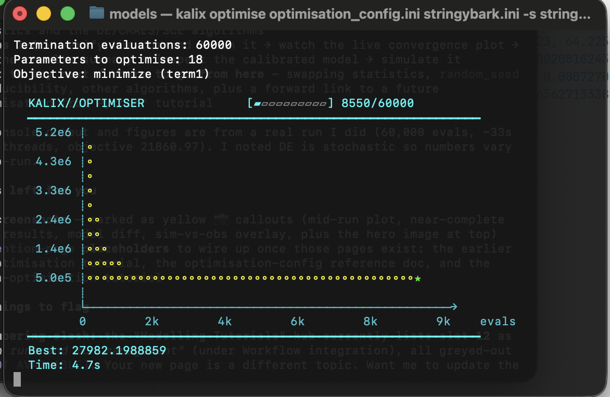
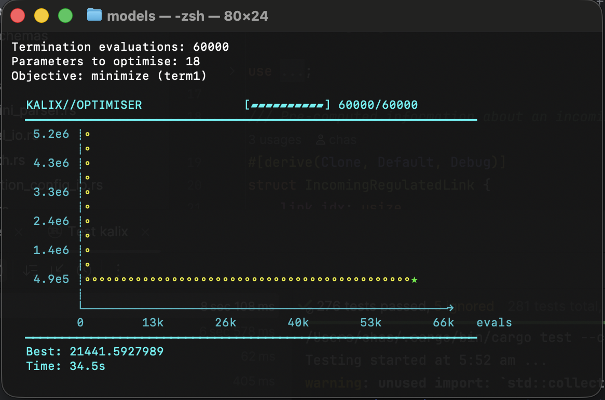
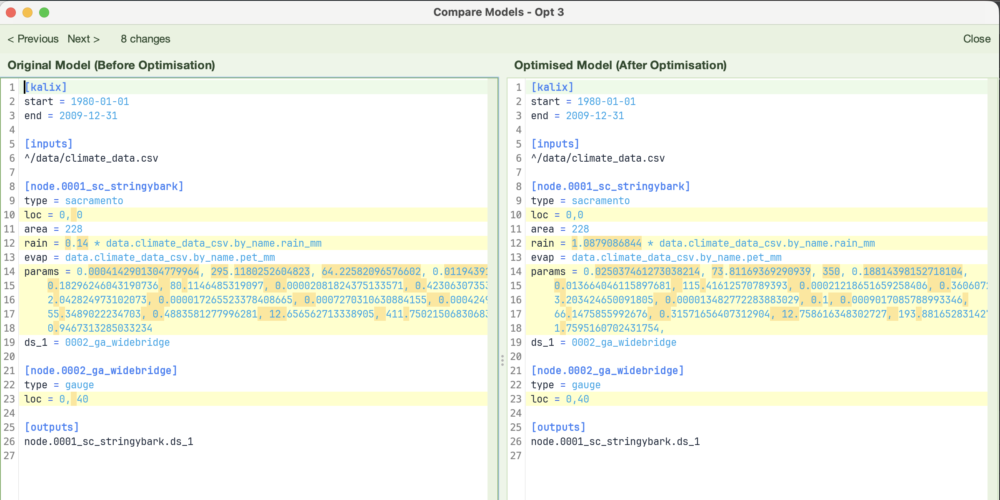
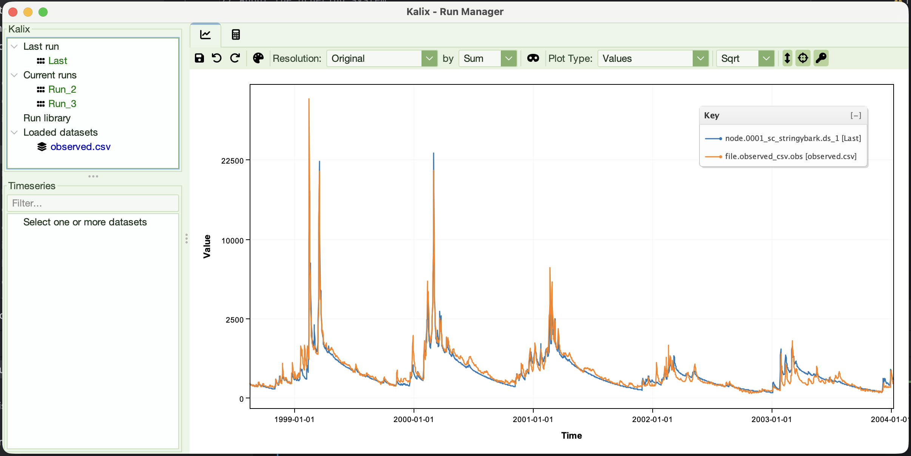

# Tutorial 12 — Optimisation from the commandline

**Tutorial 12 of the Kalix tutorial series.** You'll calibrate the Stringybark Creek model from a terminal using `kalix optimise` — reading an optimisation config file, watching the live convergence plot, and saving a calibrated model ready to run. Expected time: about 20 minutes.

## What you'll build

A working command-line calibration of the Stringybark catchment model. You'll point `kalix optimise` at an optimisation **config file** and a **model file**, let the Differential Evolution optimiser tune 18 parameters against an observed flow record, watch it converge in the terminal, and write out a calibrated model file ready to simulate.





## Prerequisites

- **Optimisation in the GUI** — you should already have run a calibration inside Kalix IDE (covered in an earlier optimisation tutorial — *[mention-page placeholder once that tutorial is published]*). This tutorial assumes you understand the basic idea: parameters, an objective statistic, and an observed series to fit against. Here we just move that same workflow to the command line.

- **Tutorial 4 complete** — see [Tutorial 4 — Running Kalix from the commandline](04-commandline.md). We reuse the `kalix` CLI and the same project conventions (trailhead paths, `kalix sim`).

- **Kalix CLI installed** — see [Downloads](../downloads.md). Verify with `kalix --version` from a fresh terminal.

- **Tutorial files** — download the `012/` folder from the [KalixTutorials repository](https://github.com/chasegan/KalixTutorials/tree/main/012).

## Project layout

```
012/
├── data/
│   ├── climate_data.csv             # rain_mm + pet_mm
│   └── observed.csv                 # obs — the streamflow we calibrate against
└── models/
    ├── stringybark.ini              # the starting model
    ├── optimisation_config.ini      # the calibration recipe
    └── stringybark_calibrated.ini   # the result (we'll regenerate this)
```

The model uses trailhead paths (`^/data/...`), so it runs from any depth — exactly as you set up in Tutorial 3. All commands below assume you've changed into `012/models/`.

## The two ingredients

Calibration on the command line needs two files:

1. **The model file** (`stringybark.ini`) — the thing being calibrated. It's an ordinary Kalix model with starting parameter values. The optimiser overwrites the parameters listed in the config and leaves everything else untouched.

2. **The optimisation config** (`optimisation_config.ini`) — the *recipe*: which parameters to tune, over what ranges, against which observed data, using which objective and algorithm.

This mirrors `kalix simulate` from Tutorial 4, which took a single model file. `kalix optimise` takes the config **and** the model.

## Anatomy of the optimisation config

Open `optimisation_config.ini`. It has three parts.

### The `[optimisation]` section — the algorithm

```toml
[optimisation]
objective_expression = term1
algorithm = DE
de_cr = 0.9
population_size = 50
de_f = 0.8
termination_evaluations = 60000
n_threads = 12
```

Line by line:

- `objective_expression = term1` — the quantity to **minimise**. It refers to a term defined below. It's an expression, so you can combine several terms — e.g. `0.5*term1 + 0.5*term2` — for multi-objective calibration.

- `algorithm = DE` — the search algorithm. Kalix supports several including `DE` (Differential Evolution), `CMAES` (CMA-ES), and `SCE` (Shuffled Complex Evolution).

- `de_cr = 0.9`, `de_f = 0.8` — DE's crossover rate and differential weight. The defaults (0.9 and 0.8) are sensible; leave them unless you know you want to change them.

- `population_size = 50` — number of candidate parameter sets DE maintains each generation.

- `termination_evaluations = 60000` — stop after this many model runs. More evaluations means a more thorough search but a longer run.

- `n_threads = 12` — evaluate candidates in parallel across this many threads. Set it near your CPU's core count.

### The `[term.term1]` section — the objective

```toml
[term.term1]
simulated = node.0001_sc_stringybark.ds_1
observed_file = ../data/observed.csv
observed_series = 1
statistic = SDEB
```

A **term** pairs a simulated series with an observed one and scores the fit:

- `simulated = node.0001_sc_stringybark.ds_1` — the model output to compare. This is the same series you'd list under `[outputs]` to record (and indeed `stringybark.ini` records exactly this).

- `observed_file = ../data/observed.csv` — the observed data, as a relative path from the config folder.

- `observed_series = 1` — which value column to use. It's a **1-based index over the value columns** (the date column doesn't count), so `1` is the `obs` column. You can also name it directly: `observed_series = obs`.

- `statistic = SDEB` — the goodness-of-fit measure. **Every Kalix statistic is framed so that lower is better and 0 is perfect.** Available options:

| Name | Meaning |
| --- | --- |
| `SDEB` | Sorted Data Error with Bias — blends timing error, flow-distribution error, and a bias penalty. A good general-purpose default. |
| `ONE_MINUS_NSE` | 1 − Nash–Sutcliffe Efficiency. |
| `ONE_MINUS_LNSE` | 1 − log-NSE. Emphasises low flows. |
| `ONE_MINUS_KGE` | 1 − Kling–Gupta Efficiency. |
| `ONE_MINUS_PEARS_R` | 1 − Pearson correlation. |
| `RMSE` | Root mean square error. |
| `MAE` | Mean absolute error. |
| `ABS_PBIAS` | Absolute percent bias. |

### The `[parameters]` section — what to tune

```toml
[parameters]
node.0001_sc_stringybark.adimp = log_range(g(1),1E-05,0.15)
node.0001_sc_stringybark.lzfpm = log_range(g(2),1,300)
...
node.0001_sc_stringybark.laguh = lin_range(g(17),0,3)
node.0001_sc_stringybark.rf_bias = lin_range(g(18),0.7,1.3)
```

Each line maps a **model property** to a search range driven by a **gene** `g(n)`:

- The left side is the address of the parameter to optimise — the same dotted path you'd use anywhere else in Kalix. Here we tune the 17 Sacramento parameters plus `rf_bias`, a rainfall bias-correction factor on the node. (`rf_bias` shows up in the saved model as the leading multiplier on the `rain =` expression — the link back to the expressions you wrote in Tutorial 2.)

- `g(n)` is the *n*-th optimisation variable: a normalised value in `[0, 1]` that the algorithm searches. Each gene is used once.

- `log_range(g(n), min, max)` searches **logarithmically** between `min` and `max` — right for parameters spanning orders of magnitude, like storage capacities and rate constants.

- `lin_range(g(n), min, max)` searches **linearly** — right for parameters with a natural additive scale, like `laguh` (lag, 0–3 days) and `rf_bias` (0.7–1.3).

For the full optimisation-config reference (every key, every statistic and algorithm), see the optimisation reference — *[mention-page placeholder]*.

## Step 1 — Verify the command

From `012/models/`, check the subcommand and its flags:

```bash
kalix help optimise
```

```
Run parameter optimisation

Usage: kalix optimise [OPTIONS] <CONFIG_FILE> [MODEL_FILE]

Arguments:
  <CONFIG_FILE>  Path to the optimisation configuration file (.ini)
  [MODEL_FILE]   Path to the model file (.ini). Overrides model_file in config if specified

Options:
  -s, --save-model <SAVE_MODEL>     Path to save the optimised model file (.ini)
  -q, --quiet                       Suppress terminal output and plotting
  -r, --report-frequency <N>        Plot updates every N evaluations [default: 20]
  -p, --profile                     Report execution time profile
  -h, --help                        Print help
```

## Step 2 — Run the optimisation

```bash
kalix optimise optimisation_config.ini stringybark.ini -s stringybark_calibrated.ini
```

The three arguments:

- `optimisation_config.ini` — the config (the recipe).

- `stringybark.ini` — the model to calibrate.

- `-s stringybark_calibrated.ini` — where to write the calibrated model. Without `-s`, the optimiser still runs and reports results, but writes no file.

Kalix first echoes back what it parsed, so you can sanity-check the setup before the search starts:

```
Loading optimisation configuration: optimisation_config.ini
Objective expression: term1
Terms (1):
  term1 = SDEB(node series 'node.0001_sc_stringybark.ds_1', obs '../data/observed.csv')
Algorithm: DE
Population size: 50
Termination evaluations: 60000
Number of parameters: 18
Loading model: stringybark.ini
Term 'term1': loaded 10958 observed points from ../data/observed.csv

=== Starting Optimisation ===
```

## Step 3 — Watch it converge

As it runs, Kalix draws a live convergence plot right in the terminal — best objective value (vertical axis) against evaluations (horizontal axis), with a progress bar and a running best score. You'll watch the curve drop steeply at first, then flatten as the search homes in.


The whole 60,000-evaluation run finishes in roughly **30 seconds** on a 12-thread machine — each model run is only a few milliseconds, and `n_threads` evaluates many in parallel. Prefer a clean run with no plotting (e.g. for logging)? Add `-q`.

## Step 4 — Read the results summary

When it finishes, Kalix prints a summary: the final objective value, the optimised genes (normalised `[0,1]`), and the same parameters as **physical values** — the numbers that actually go into the model.

```
=== Optimisation Complete ===
Status: SUCCESS
Message: Optimisation completed successfully
Function evaluations: 60000
Best objective value: 21860.969497

Optimized Parameters (physical values):
  node.0001_sc_stringybark.adimp = 0.023690
  node.0001_sc_stringybark.lzfpm = 73.962576
  ...
  node.0001_sc_stringybark.laguh = 1.847684
  node.0001_sc_stringybark.rf_bias = 1.024898

Optimized model written to: stringybark_calibrated.ini
Done!
```

Differential Evolution is **stochastic**, so your exact numbers will differ slightly from run to run (and from the file shipped in the repo). To make a run reproducible, add `random_seed = 42` to the `[optimisation]` section.

A quick read of the physical values is a useful gut-check: are any parameters pinned right at the edge of their `log_range`/`lin_range` bounds? If so, that bound may be too tight — widen it in the config and re-run.

## Step 5 — Inspect the calibrated model

Open `stringybark_calibrated.ini`. It's a complete, runnable model — identical to `stringybark.ini` except for the tuned parameters:

- The `params = ...` line now holds the optimised Sacramento values.

- The `rain = ...` line's leading multiplier has changed from the starting value to the calibrated `rf_bias`, e.g. `rain = 1.024898 * data.climate_data_csv.by_name.rain_mm`.



## Step 6 — Simulate the calibrated model

The calibrated file is just a model, so run it the way you ran models in Tutorial 4:

```bash
kalix sim stringybark_calibrated.ini -o calibrated_results.csv
```

Load `calibrated_results.csv` and `../data/observed.csv` and overlay them (in the IDE, the Run Manager, or pandas as in Tutorial 5). The calibrated simulation should track the observed hydrograph noticeably better than the starting model did.



## What to try next

Change one thing at a time and re-run.

1. **Swap the objective statistic** — change `statistic = SDEB` to `ONE_MINUS_LNSE` and re-run. Log-NSE rewards low-flow fit; compare the recession limbs against the SDEB calibration.

2. **Make it reproducible** — add `random_seed = 42` to `[optimisation]`, run twice, and confirm you get identical results.

3. **Trade runtime for thoroughness** — drop `termination_evaluations` to `10000` for a quick-and-rough fit, or raise it to `120000` for a more exhaustive search. Watch the convergence plot to judge whether more evaluations are still buying improvement.

4. **Try another algorithm** — switch `algorithm = DE` to `algorithm = SCE` (add `complexes = 5`) or `algorithm = CMAES` (add `sigma = 0.3`). Compare final objective values and convergence behaviour.

5. **Hold parameters fixed** — if you trust some parameters, remove their lines from `[parameters]` so the optimiser focuses on the rest.

## Where to go from here

- **Optimisation from Python** — the same calibration driven from a notebook via the `kalix` package, so you can script multi-site calibrations and post-process the results in pandas. CLI for batch and automation; Python for analysis — the same split you saw between [Tutorial 4 — Running Kalix from the commandline](04-commandline.md) and [Tutorial 5 — Running Kalix from Python](05-python.md). *[mention-page placeholder once the Python optimisation tutorial is published]*

For the full CLI reference (every command, every flag), see [Commandline](../docs/using/cli.md).
