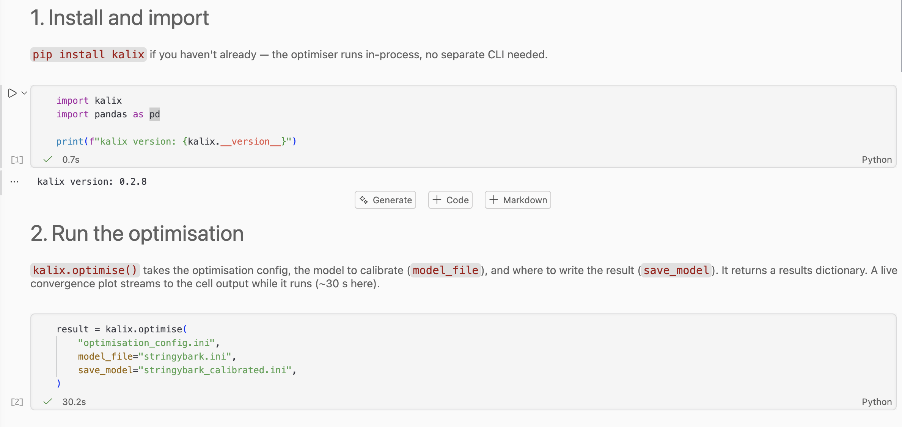
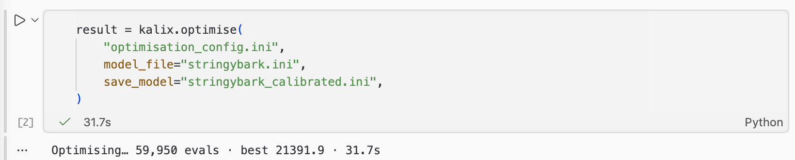
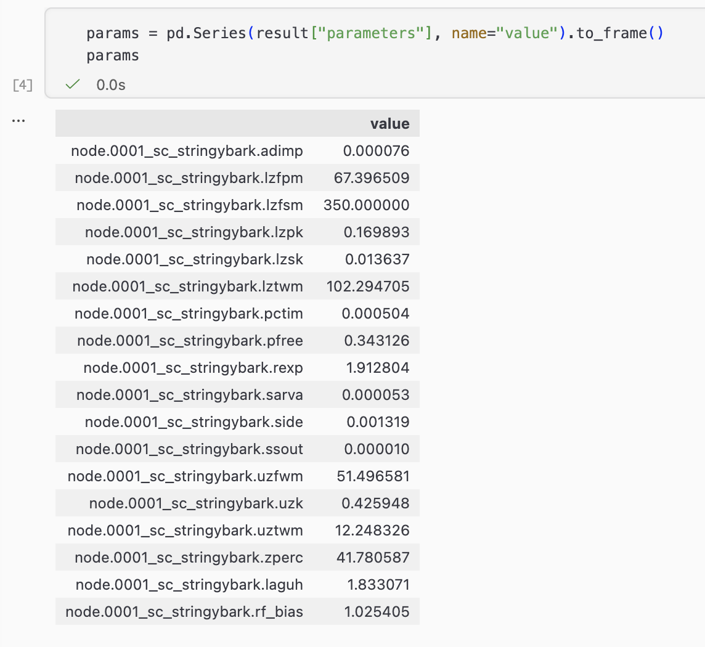
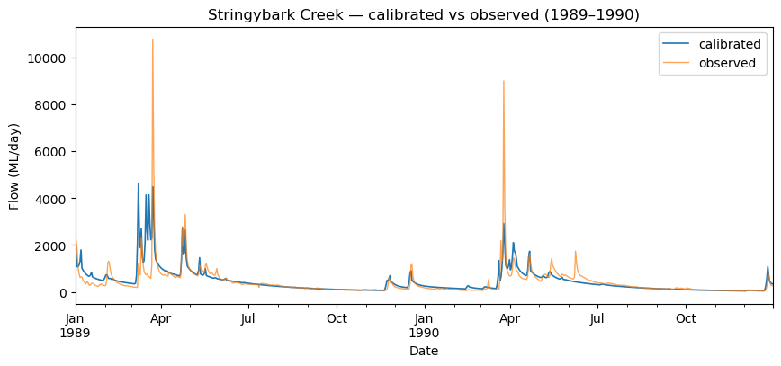

# Tutorial 13 — Optimisation from Python

**Tutorial 13 of the Kalix tutorial series.** You'll run the same Stringybark Creek calibration as Tutorial 12 — but driven from Python with `kalix.optimise()`, reading the result back as a dictionary, then simulating and plotting the calibrated model in a notebook. Expected time: about 20 minutes.

## What you'll build

A Jupyter notebook that calibrates the Stringybark catchment model in one call, inspects the optimised parameters as a pandas object, and overlays the calibrated simulation against the observed record. This is the analysis-friendly counterpart to Tutorial 12's command-line workflow — same optimisation, same config file, driven from Python.




## Prerequisites

- **Tutorial 12 complete** — see [Tutorial 12 — Optimisation from the commandline](01-first-model.md). We reuse its exact optimisation config and model, so the concepts (terms, statistics, parameter ranges, algorithms) carry straight over. This tutorial only changes *how* you launch the run.

- **Tutorial 5 complete** — see [Tutorial 5 — Running Kalix from Python](05-python.md). We build on the same `pip install kalix` package and the `simulate()` / pandas / matplotlib pattern you learned there.

- **Python 3.9 or newer** with Jupyter installed.

- **Tutorial files** — download the `013/` folder from the [KalixTutorials repository](https://github.com/chasegan/KalixTutorials/tree/main/013). It also ships a fully-worked `analysis.ipynb` if you'd rather skim than type along.

## Project layout

```
013/
├── data/
│   ├── climate_data.csv
│   └── observed.csv
└── models/
    ├── stringybark.ini              # the starting model
    ├── optimisation_config.ini      # the calibration recipe (same as Tutorial 12)
    └── analysis.ipynb               # the notebook we'll write
```

The notebook sits **next to the model and config files**, so the relative paths inside the config (`../data/observed.csv`) and the notebook resolve cleanly. Launch Jupyter from `013/models/`.

## The CLI and Python, side by side

The `kalix` Python package mirrors the CLI. Tutorial 12's command:

```bash
kalix optimise optimisation_config.ini stringybark.ini -s stringybark_calibrated.ini
```

becomes, in Python:

```python
result = kalix.optimise(
    "optimisation_config.ini",
    model_file="stringybark.ini",
    save_model="stringybark_calibrated.ini",
)
```

Same three pieces — the config, the model, and where to save the calibrated model. The difference: the CLI prints a summary to the terminal, while Python **returns the results to you as a dictionary** you can work with directly.

Everything from [Tutorial 12 — Optimisation from the commandline](01-first-model.md) still applies — the `[optimisation]`, `[term.*]`, and `[parameters]` sections of the config are read exactly the same way. If you want to change the algorithm, statistic, or parameter ranges, you edit `optimisation_config.ini`, not the Python.

## Step 1 — Open a notebook in the model folder

Open the `013/models` folder inside your favourite Jupyter Notebook editor (e.g. VSCode or Jupyter Lab). Create a new notebook called `analysis.ipynb`.

## Step 2 — Import Kalix and check the version

```python
import kalix
import pandas as pd

print(f"kalix version: {kalix.__version__}")
```

The optimiser runs in-process from the `kalix` package — **you don't need the Kalix CLI installed separately** for this tutorial.

## Step 3 — Run the optimisation

```python
result = kalix.optimise(
    "optimisation_config.ini",
    model_file="stringybark.ini",
    save_model="stringybark_calibrated.ini",
)
```

The arguments mirror the CLI:

- The first positional argument is the **config file**.

- `model_file=` is the **model to calibrate** (overrides any `model_file` set inside the config).

- `save_model=` writes the **calibrated model** to disk. It's optional — the calibrated model also comes back inside the returned dictionary either way.

By default, `kalix.optimise()` prints a progress line while it runs — in a notebook it updates a single line in place (evaluations, best objective, elapsed time). The 60,000-evaluation run takes roughly **30 seconds**.



If you want to handle progress callbacks yourself, pass `progress=<callable>` into the function. It is called once per generation with a dict (`n_evaluations`, `best_objective`, `elapsed_seconds`), and the built-in line is suppressed. Pass `progress=False` if you want to have no progress output.

## Step 4 — Inspect the result

`kalix.optimise()` returns a dictionary summarising the run:

```python
print(f"success:        {result['success']}")
print(f"message:        {result['message']}")
print(f"evaluations:    {result['n_evaluations']}")
print(f"best objective: {result['best_objective']:.3f}")
```

```
success:        True
message:        Optimisation completed successfully
evaluations:    60000
best objective: 22498.867
```

The full set of keys:

| Key | What it holds |
| --- | --- |
| `best_objective` | The best objective value found (float, lower is better). |
| `n_evaluations` | Number of model runs performed (int). |
| `success` | Whether the optimiser terminated successfully (bool). |
| `message` | The optimiser's termination message (str). |
| `parameters` | The optimised parameters as a `{target: physical_value}` dict. |
| `optimised_model_ini` | The calibrated model serialised back to an INI string. |

Differential Evolution is **stochastic**, so your `best_objective` and parameters will differ slightly from the values shown here. To make a run reproducible, add `random_seed = 42` to the `[optimisation]` section of the config.

## Step 5 — The parameters as a DataFrame

Because `parameters` is a plain dict, it drops straight into pandas:

```python
params = pd.Series(result["parameters"], name="value").to_frame()
params
```

You'll get a tidy table of all 18 optimised values, indexed by target (e.g. `node.0001_sc_stringybark.lztwm`, `node.0001_sc_stringybark.rf_bias`). From here it's ordinary pandas — sort it, export it, or compare parameter sets across several calibrations.



## Step 6 — Simulate and plot the calibrated model

`save_model=` already wrote `stringybark_calibrated.ini`. It's an ordinary model file, so simulate it with `kalix.simulate()` exactly as in Tutorial 5, then overlay it against the observed record:

```python
kalix.simulate("stringybark_calibrated.ini", output_file="calibrated_results.csv")

sim = pd.read_csv("calibrated_results.csv", parse_dates=[0], index_col=0)
obs = pd.read_csv("../data/observed.csv", parse_dates=["Date"], index_col="Date")
```

```python
import matplotlib.pyplot as plt

fig, ax = plt.subplots(figsize=(10, 4))
window = slice("1989-01-01", "1990-12-31")
sim.loc[window, "node.0001_sc_stringybark.ds_1"].plot(ax=ax, label="calibrated", linewidth=1.2)
obs.loc[window, "obs"].plot(ax=ax, label="observed", alpha=0.7, linewidth=1.0)
ax.set_ylabel("Flow (ML/day)")
ax.set_title("Stringybark Creek — calibrated vs observed (1989–1990)")
ax.legend();
```

The calibrated simulation should track the observed hydrograph noticeably better than the starting model did.



## Step 7 (bonus) — The calibrated model as a string

The returned dict also carries the calibrated model as INI text under `optimised_model_ini` — the same content `save_model=` wrote to disk:

```python
print(result["optimised_model_ini"])
```

This is handy when you'd rather keep the calibrated model in memory — log it, diff it against the starting model, or feed it onward — without a round-trip through a file.

## What to try next

- **Loop over scenarios** — wrap `kalix.optimise()` in a loop that varies something between runs (e.g. the objective `statistic`, or `termination_evaluations`), and stack each run's `parameters` into a single DataFrame for comparison.

- **Compare statistics** — point the config's `statistic` at `ONE_MINUS_LNSE` instead of `SDEB`, re-run, and plot both calibrated hydrographs against observed to see how the low-flow fit changes.

- **Make it reproducible** — add `random_seed = 42` to the config's `[optimisation]` section and confirm two runs return identical `best_objective` values.

## Where to go from here

- [Tutorial 12 — Optimisation from the commandline](01-first-model.md) — the command-line counterpart to this tutorial. CLI for batch and automation; Python for analysis — the same split you saw between Tutorials 4 and 5.

The `kalix` Python package lives on PyPI: [pypi.org/project/kalix](http://pypi.org/project/kalix). Current functionality and API are documented in the package README.
