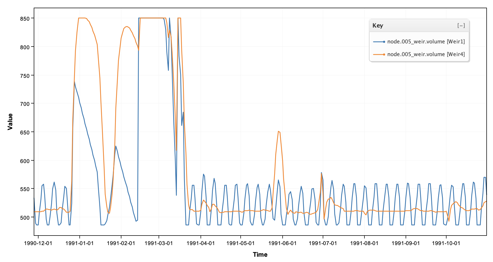
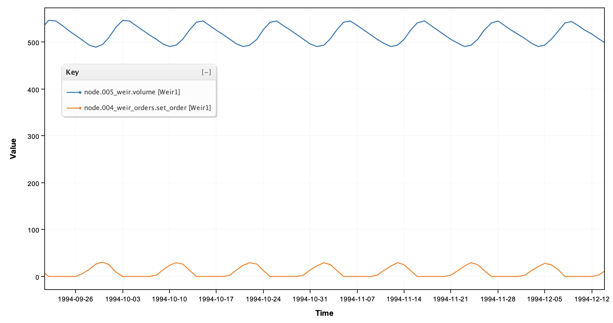
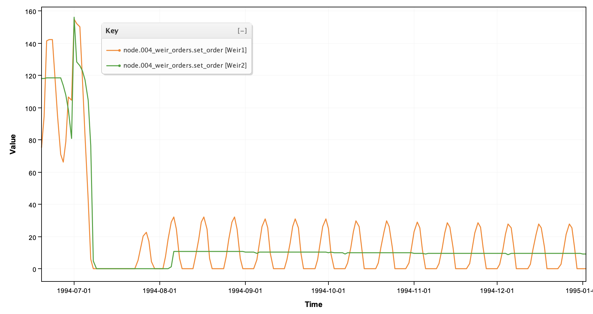
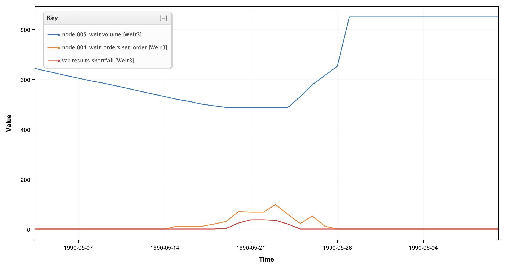
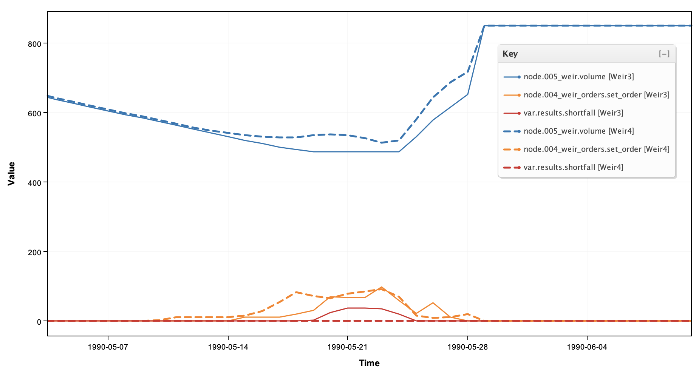

# Tutorial 18 — Weir pulsing

**Tutorial 18 of the Kalix tutorial series.** You'll build a small regulated system — a dam supplying a downstream re-regulating weir — and watch an intuitive ordering rule drive the weir into sustained oscillation. You'll diagnose why, stabilise it, then make the routing more realistic and fix the harder problem that creates. Expected time: about 30 minutes.

## What you'll build

Four variants of one seven-node model:

1. **`weir1_lag_naive.ini`** — simple lag routing and an intuitive ordering rule. It pulses.

2. **`weir2_lag_stable.ini`** — the same system with an *order-up-to* rule. Stable.

3. **`weir3_pwl.ini`** — storage routing replaces the pure lag. The pulsing comes back.

4. **`weir4_pwl_stable.ini`** — a reach-aware rule that restores stability.

Along the way you'll meet a genuinely useful idea from operations: **water you have already ordered is not water you need to order again.**



## Prerequisites

- **Kalix software** and the **Tutorial files** — refer to [Tutorial 1 — Your first model](01-first-model.md).

- **Tutorial 2 complete** (or its concepts) — the rules in this tutorial are [program-block expressions](02-expressions.md).

- Skim the [Ordering](../docs/ordering.md) and [Order_Control](../docs/order-control.md) pages — this tutorial leans on both.

- **Tutorial files** — download the `018/` folder from the [KalixTutorials repository](https://github.com/chasegan/KalixTutorials/tree/main/018).

## The system

```
018/
├── data/
│   ├── inflows.csv          ← dam inflows, 1990–1999
│   └── orders.csv           ← downstream orders arriving at the weir
└── models/
    ├── weir1_lag_naive.ini
    ├── weir2_lag_stable.ini
    ├── weir3_pwl.ini
    └── weir4_pwl_stable.ini
```

Seven nodes in a line: an inflow feeds a large dam (`002_dam`, ~100 GL); releases travel down a routed reach (`003_routing`, two days of lag) to a small re-regulating weir (`005_weir`); downstream orders arrive at the weir from `006_demand`. The weir's job is to re-regulate: hold a working volume and release each day's orders on time.

Two numbers define the weir's operating envelope, straight from its `dimensions` table:

- **Target volume: 510 ML** — the level operators aim to hold.

- **Minimum operating level: 486 ML** (`ds_1_outlet = 275.0`) — below this the outlet can't draw, and deliveries fail.

That leaves a working cushion of just **24 ML**, while daily orders run up to 235 ML. The weir cannot survive on its own storage — every day, someone must decide how much to order down from the dam. That decision lives in the `order_control` node `004_weir_orders`, and it must be made **two days before the water arrives**.

## Step 1 — The intuitive rule

Open `models/weir1_lag_naive.ini` and look at `004_weir_orders`:

```ini
[node.004_weir_orders]
type = order_control
loc = 0, 120
set_order = {
      release_today = node.005_weir.ds_1_order;
      correction = 510 - node.005_weir.volume[-1, 510];
      max(0, release_today + correction)
    }
ds_1 = 005_weir
```

Replace today's release, and steer back toward the target: if the weir ended yesterday below 510, order extra; if above, order less. Most people's first rule looks like this. It reads like a thermostat, and thermostats work — right?

## Step 2 — Run it and meet the pulsing

```bash
cd 018/models
kalix simulate weir1_lag_naive.ini -o results1.csv
```

Plot `node.005_weir.volume` and `node.004_weir_orders.set_order` for **October–November 1994**, a period where downstream demand is nearly constant at 9.9 ML/day:



The demand is flat, yet the weir cycles endlessly between about 490 and 546 ML, and the orders swing 0 → 30 → 0 with an eleven-day period. This is **weir pulsing** — a self-sustained oscillation created by the rule itself. Over the full ten years it's not just cosmetic: the weir spends 711 days failing to meet orders, for a total shortfall of about 23,000 ML.

**Why does it happen?** Travel time. Suppose the weir dips 30 ML below target on Monday. The rule orders +30. That water arrives *Wednesday*. On Tuesday the weir is still low — so the rule orders +30 again. Wednesday morning, still low — +30 a third time. Then the three corrections land on consecutive days, the weir overshoots ~60 ML above target, and the rule swings the other way: order nothing, drift down, cross the target, dip below… and the cycle repeats forever. The rule keeps correcting a deficit that is already fixed — the fix just hasn't arrived yet.

## Step 3 — The order-up-to rule

The cure is to give the rule a memory of what it has already ordered. Open `models/weir2_lag_stable.ini`:

```ini
set_order = {
      target = 510;
      v_yesterday = node.005_weir.volume[-1, 510];
      release_today = node.005_weir.ds_1_order;
      release_forecast = moving_max(node.005_weir.ds_1_order, 5, 0);
      in_transit = this.set_order[-1, 0] + this.set_order[-2, 0];
      max(0, target - v_yesterday + release_today + 2 * release_forecast - in_transit)
    }
```

Read it as a little mass balance projected two days ahead — *"order whatever brings the weir back to target at the moment today's order arrives"*:

- `target - v_yesterday` — the deficit (or surplus) we start from.

- `release_today + 2 * release_forecast` — everything the weir will release before today's order lands: today's known orders, plus two future days estimated from the recent peak (`moving_max` over 5 days — deliberately a touch conservative, and over-ordered water isn't lost: it sits in the weir and is netted off tomorrow's order by the next term).

- `- in_transit` — **the fix**: subtract the orders placed yesterday and the day before, which are already on their way. This is the term the naive rule was missing.

Run it:

```bash
kalix simulate weir2_lag_stable.ini -o results2.csv
```



The limit cycle is gone — flat demand now gives a flat weir. Across the decade, shortfall drops from ~23,000 ML to ~1,900 ML, and what remains is demand *spikes* exceeding anything in the previous five days, which no backward-looking forecast can see coming.

## Step 4 — Make the routing realistic

Real reaches don't just delay water — they stretch it, and low flows travel slower than high flows. Open `models/weir3_pwl.ini`. It is `weir2` with one change at the routing node:

```ini
[node.003_routing]
type = routing
loc = 0, 80
lag = 2
typical_regulated_flow = 100
pwl = 0,5, 30,3, 50,2.7, 100,0.2, 200,0.05, 500,0.01, 1000,0, 2000,0
ds_1 = 004_weir_orders
```

The `pwl` table adds piecewise-linear **storage routing** on top of the two-day lag: at 100 ML/day the extra travel time is negligible (0.2 days), but a 30 ML/day trickle takes an extra *three days* to work through the reach. Run it and plot the weir volume for **May 1990**, when the irrigation season starts up:



As demand ramps from 10 to 70 ML/day, the rule orders correctly — but the weir crashes onto its minimum operating level and sits there for six days, shorting deliveries by up to 36 ML/day. Decade-wide shortfall triples to ~6,000 ML. The order-up-to rule still "works", but something is quietly eating the water it orders.

## Step 5 — Where the water went

A reach with storage routing doesn't just carry water — it *holds* water, and how much it holds depends on flow. In Kalix the steady-state volume in the reach is the **integral of the travel-time curve**:

| flow (ML/d) | 0 | 30 | 50 | 100 | 200 |
| --- | --- | --- | --- | --- | --- |
| reach volume (ML) | 0 | 120 | 177 | 249.5 | 262 |

Follow the May 1990 ramp through that table. While flow rises from ~10 to ~70 ML/day, the reach's own storage must grow by roughly 150 ML — and it takes that water **from the flow passing through it**, before deliveries respond. The first days of every ramp-up are quietly taxed to fill the channel; on ramp-down the reach gives the water back, arriving after it's wanted. The rule's `in_transit` bookkeeping assumes everything ordered arrives in two days, so during transitions its ledger is wrong by up to ~250 ML — ten times the weir's operating cushion.

## Step 6 — The reach-aware rule

If the reach will absorb `V(q_future) − V(q_now)`, order it up-front. Open `models/weir4_pwl_stable.ini`. It adds a lookup table — the integral of the pwl travel times — and two lines to the rule:

```ini
# steady-state reach storage: the integral of the pwl travel times
[table.reach_storage]
values = 0,0, 15,67.5, 30,120, 40,149.25, 50,177, 75,228.875, 100,249.5,
         150,257.625, 200,262, 350,268, 500,271, 750,272.875, 1000,273.5, 2000,273.5,
```

```ini
      q_now = node.003_routing.ds_1[-1, 0];
      q_future = max(moving_max(node.002_dam.ds_1[-1, 0], 5, 0), release_forecast);
      reach_adjust = table.reach_storage(q_future) - table.reach_storage(q_now);
      max(0, target - v_yesterday + release_today + 2 * release_forecast - in_transit + reach_adjust)
```

`reach_adjust` is the volume the reach is about to swallow (or release) as flow moves from yesterday's rate to the anticipated rate. It is zero in steady state, anticipates ramps in both directions, and self-corrects through the volume feedback — any error simply shows up in tomorrow's `v_yesterday`.

```bash
kalix simulate weir4_pwl_stable.ini -o results4.csv
```



Same May 1990 ramp: the rule now starts lifting its orders about two days before the naive ledger would, the reach fills without raiding deliveries, and the weir never leaves its operating band. The decade's shortfall lands at ~1,400 ML — better than even the pure-lag case.

Two housekeeping notes worth carrying to real models. The table is **derived from the routing parameters**, so if the `pwl` is refitted, regenerate the table (breakpoints at the pwl flows plus midpoints — the true curve is quadratic between points). And a mismatched table is worse than none: this correction sized for a 250 ML reach, applied to a near-pure-lag reach, would itself become the oscillator.

## Results summary

| model | routing | rule | shortfall (10 yrs) | shortfall days |
| --- | --- | --- | --- | --- |
| weir1 | lag | naive | 23,115 ML | 711 |
| weir2 | lag | order-up-to | 1,876 ML | 66 |
| weir3 | lag + pwl | order-up-to | 6,037 ML | 192 |
| weir4 | lag + pwl | order-up-to + reach | 1,373 ML | 36 |

## What you learned

- **Weir pulsing** is a feedback instability, not noise: a rule that corrects a deficit without remembering its own in-transit orders re-corrects the same deficit once per day of travel time, then overshoots.

- The **order-up-to** pattern fixes it: project a mass balance to the arrival day — deficit, plus releases until then, **minus orders already in transit**.

- **Storage routing changes the mass balance**: a reach holds flow-dependent storage (the integral of its travel-time curve), absorbing water on ramp-up and disgorging it on ramp-down.

- The fix is one lookup table and one term — and it must **match the actual routing**.

## Explore further

- Set the pwl travel times to zero in `weir4` and watch `reach_adjust` do no harm — then double them and regenerate the table.

- Replace `moving_max(..., 5, 0)` with plain `release_today` in `weir2` and compare shortfalls: how much is the conservative forecast worth?

- The residual shortfalls in `weir2` and `weir4` are demand spikes no backward-looking rule can anticipate. Peek at `data/orders.csv` around the failures — would a real operator have known more?
